# <font color='blue'>Week 12 - Machine Learning Intro</font>

### <font color='red'> Used: Python and its libraries; NumPy and Pandas library. Jupyter Notebook. </font>
### <font color='red'> Used: Theano a Python library, Tensorsflow 2.x and Sparks </font>


* Theano a Python library to define, optimize, and evaluate mathematical expressions

* It can perform speedy caclculations for large amounts of data

* It combines aspects of a computer algebra system (CAS) with aspects of an optimizing compiler

http://deeplearning.net/software/theano/introduction.html


## ****Theano's compiler****

Theano’s compiler applies many optimizations of varying complexity to these symbolic expressions. These optimizations include, but are not limited to:

* use of GPU for computations
* constant folding
* merging of similar subgraphs, to avoid redundant calculation
* arithmetic simplification (e.g. x*y/x -> y, --x -> x)
* inserting efficient BLAS operations (e.g. GEMM) in a variety of contexts
* using memory aliasing to avoid calculation
* using inplace operations wherever it does not interfere with aliasing
* loop fusion for elementwise sub-expressions
* improvements to numerical stability (e.g. \log(1+\exp(x)) and \log(\sum_i \exp(x[i])))
* for a complete list of Optimizations, consult the following link

http://deeplearning.net/software/theano/optimizations.html#optimizations

**Load the desired libraries**


```python
import numpy
import theano.tensor as theaTens
from theano import function
```


```python
x=theaTens.dscalar('x')
y=theaTens.dscalar('y')
z=x+y
f=function([x,y],z)
```


```python
f(4,9)
```


    array(13.)


```python
type(x)
```


    theano.tensor.var.TensorVariable


```python
x.type
```


    TensorType(float64, scalar)


z is yet another Variable which represents the addition of x and y. Let's use the pp function to pretty-print out the computation associated to z.


```python
 from theano import pp #pretty-print
 print(pp(z))
```

    (x + y)
    


```python
z.eval({x: 11.11 , y: 22.22})
```


    array(33.33)


-----------X--------------X----------------X---------------

K-Means Clustering:


```python
import matplotlib.pyplot as matPlotLibPyplot
from sklearn.datasets import make_blobs
x,y = make_blobs(n_samples=50, centers=5, random_state=100, cluster_std=.5)
```


```python
y # numbers of sample types
```


    array([0, 0, 2, 1, 0, 4, 2, 1, 1, 0, 1, 2, 3, 2, 4, 1, 0, 4, 3, 2, 2, 2,
           2, 0, 3, 1, 3, 0, 3, 1, 2, 4, 0, 3, 3, 0, 4, 1, 4, 0, 3, 4, 3, 4,
           3, 1, 1, 4, 2, 4])


```python
x[0:5]
```


    array([[  0.96035818,  -3.9640712 ],
           [  0.64903102,  -4.99177142],
           [-10.37564596,  -7.98258377],
           [ -1.88782434,   7.30374965],
           [  0.63908534,  -4.21503055]])


```python
x[:,1][0:5]
```


    array([-3.9640712 , -4.99177142, -7.98258377,  7.30374965, -4.21503055])


```python
matPlotLibPyplot.scatter(x[:,0],x[:,1], s=90, edgecolors='blue', c='black')
```


    <matplotlib.collections.PathCollection at 0x7fc8acc76828>


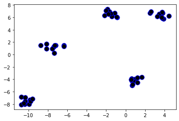


```python
import matplotlib.pyplot as matPlotLibPyplot
from sklearn.datasets import make_blobs

x1,y1=make_blobs(n_samples=50, centers=3, random_state=100, cluster_std=0.5)
matPlotLibPyplot.scatter(x1[:,0], x1[:,1], s=90, edgecolors='red', c='black')
```


    <matplotlib.collections.PathCollection at 0x7fc8acb29eb8>


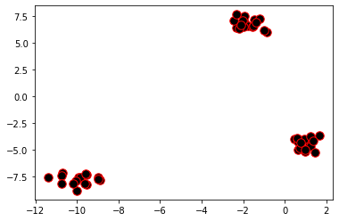


```python
x1[0:5]
```


    array([[-1.95054738,  6.90484212],
           [-8.98965484, -7.56710887],
           [ 0.70497981, -4.40477429],
           [ 1.67758967, -3.66180971],
           [ 0.64903102, -4.99177142]])


```python
y1
```


    array([1, 2, 0, 0, 0, 0, 2, 2, 0, 1, 1, 1, 2, 0, 1, 0, 0, 1, 0, 1, 0, 2,
           1, 1, 1, 0, 1, 0, 0, 2, 1, 0, 2, 2, 0, 2, 2, 2, 2, 1, 0, 1, 2, 0,
           1, 1, 1, 2, 2, 2])


```python
matPlotLibPyplot.scatter(x1[:,0][0:10], x1[:,1][0:10], s=90, edgecolors='red', c='black')
```


    <matplotlib.collections.PathCollection at 0x7fc8aca9a080>


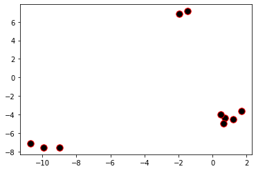


```python
from sklearn.cluster import KMeans
import matplotlib.pyplot as matPlotLibPyplot
obj_Kmeans = KMeans(5) # 5 clusters
obj_Kmeans.fit(x)
y_labels_prodicted_from_KMeans = obj_Kmeans.predict(x)
matPlotLibPyplot.scatter (x[:,0], x[:,1], s=90 ,edgecolors='black', c='yellow')
```


    <matplotlib.collections.PathCollection at 0x7fc8a7f4f630>


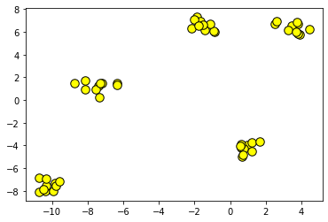


```python
from sklearn.cluster import KMeans
import matplotlib.pyplot as matPlotLibPyplot
obj_Kmeans = KMeans(9) # 5 clusters
obj_Kmeans.fit(x)
y_labels_prodicted_from_KMeans = obj_Kmeans.predict(x)
matPlotLibPyplot.scatter (x[:,0], x[:,1], s=90 ,edgecolors='black', c='yellow')
```


    <matplotlib.collections.PathCollection at 0x7fc8a7f41400>


```python
matPlotLibPyplot.scatter (x[:,0], x[:,1], s=90 , c=y_labels_prodicted_from_KMeans, edgecolors='black')
```


    <matplotlib.collections.PathCollection at 0x7fc8a7ea7cc0>


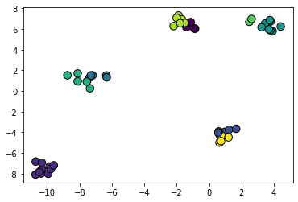


```python
matPlotLibPyplot.scatter (x[:,0], x[:,1], s=90 , c=y_labels_prodicted_from_KMeans, edgecolors='black', cmap='rainbow')
```


    <matplotlib.collections.PathCollection at 0x7fc8a7e1fb38>


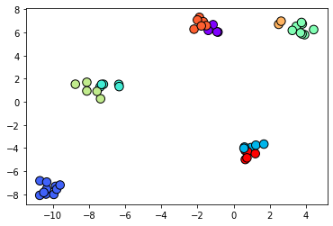


# # # ## ############ ################################## #######################


```python

```


```python

```

# Load the Iris dataset(load_iris) from sklearn datasets


```python
import matplotlib.pyplot as matPlotLibPyplot
from sklearn.datasets import load_iris

iris_dataset = load_iris()
```

# Load data in X and labels (target) in y


```python
x3= iris_dataset.data
y3= iris_dataset.target
```


```python
x3[0:5]
```


    array([[5.1, 3.5, 1.4, 0.2],
           [4.9, 3. , 1.4, 0.2],
           [4.7, 3.2, 1.3, 0.2],
           [4.6, 3.1, 1.5, 0.2],
           [5. , 3.6, 1.4, 0.2]])


```python
x3[:,0] [0:5]
```


    array([5.1, 4.9, 4.7, 4.6, 5. ])


```python
x3[:,3] [0:5]
```


    array([0.2, 0.2, 0.2, 0.2, 0.2])


```python
y3
```


    array([0, 0, 0, 0, 0, 0, 0, 0, 0, 0, 0, 0, 0, 0, 0, 0, 0, 0, 0, 0, 0, 0,
           0, 0, 0, 0, 0, 0, 0, 0, 0, 0, 0, 0, 0, 0, 0, 0, 0, 0, 0, 0, 0, 0,
           0, 0, 0, 0, 0, 0, 1, 1, 1, 1, 1, 1, 1, 1, 1, 1, 1, 1, 1, 1, 1, 1,
           1, 1, 1, 1, 1, 1, 1, 1, 1, 1, 1, 1, 1, 1, 1, 1, 1, 1, 1, 1, 1, 1,
           1, 1, 1, 1, 1, 1, 1, 1, 1, 1, 1, 1, 2, 2, 2, 2, 2, 2, 2, 2, 2, 2,
           2, 2, 2, 2, 2, 2, 2, 2, 2, 2, 2, 2, 2, 2, 2, 2, 2, 2, 2, 2, 2, 2,
           2, 2, 2, 2, 2, 2, 2, 2, 2, 2, 2, 2, 2, 2, 2, 2, 2, 2])


# Instantiate an object of KMeans with by picking up a number for clusters that  makes some sense (Hint: Have a look at your y)


```python
from sklearn.cluster import KMeans
import matplotlib.pyplot as matPlotLibPyplot

obj_Kmeans =KMeans(3)

```

# Fit the KMeans object to data to create a model and predict the labels for data


```python
obj_Kmeans.fit(x3)

y_labels_prodicted_from_KMeans=obj_Kmeans.predict(x3)
y_labels_prodicted_from_KMeans

```


    array([1, 1, 1, 1, 1, 1, 1, 1, 1, 1, 1, 1, 1, 1, 1, 1, 1, 1, 1, 1, 1, 1,
           1, 1, 1, 1, 1, 1, 1, 1, 1, 1, 1, 1, 1, 1, 1, 1, 1, 1, 1, 1, 1, 1,
           1, 1, 1, 1, 1, 1, 0, 0, 2, 0, 0, 0, 0, 0, 0, 0, 0, 0, 0, 0, 0, 0,
           0, 0, 0, 0, 0, 0, 0, 0, 0, 0, 0, 2, 0, 0, 0, 0, 0, 0, 0, 0, 0, 0,
           0, 0, 0, 0, 0, 0, 0, 0, 0, 0, 0, 0, 2, 0, 2, 2, 2, 2, 0, 2, 2, 2,
           2, 2, 2, 0, 0, 2, 2, 2, 2, 0, 2, 0, 2, 0, 2, 2, 0, 0, 2, 2, 2, 2,
           2, 0, 2, 2, 2, 2, 0, 2, 2, 2, 0, 2, 2, 2, 0, 2, 2, 0], dtype=int32)


# Create some visualisations by picking up 3 pairs of columns from X. (X have four columns. For a 2-D visualisation, one can pick any of the columns to create a 2-D visualisation)


```python

matPlotLibPyplot.scatter(x3[:,0], x3[:,1], c=y_labels_prodicted_from_KMeans,  s=90,  cmap='rainbow',  edgecolors='black')

```


    <matplotlib.collections.PathCollection at 0x7fc8a74f4be0>


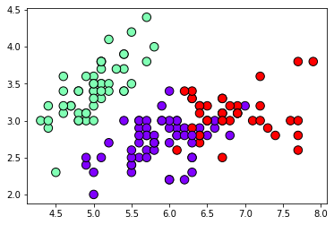


```python

```


    <matplotlib.collections.PathCollection at 0x7fafb2f0ba20>


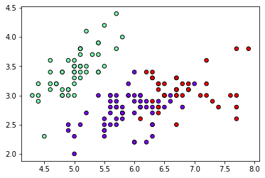


```python

matPlotLibPyplot.scatter(x3[:,1], x3[:,2], c=y_labels_prodicted_from_KMeans,  s=50,  cmap='rainbow',  edgecolors='black')

```


    <matplotlib.collections.PathCollection at 0x7fc8a7437400>


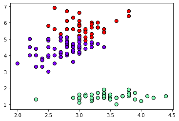


```python

```


    <matplotlib.collections.PathCollection at 0x7fafb01f1588>


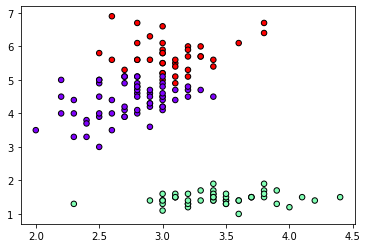


```python

matPlotLibPyplot.scatter(x3[:,2], x3[:,3], c=y_labels_prodicted_from_KMeans,  s=90,  cmap='rainbow',  edgecolors='black')

```


    <matplotlib.collections.PathCollection at 0x7fc8a774a0b8>


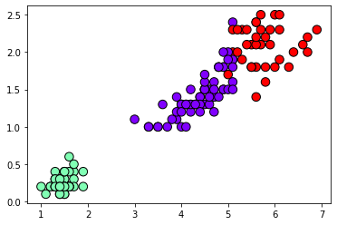


```python

```


    <matplotlib.collections.PathCollection at 0x7fafb01d96a0>


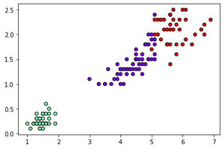

