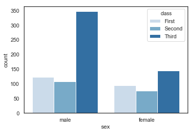

# <font color='blue'>Week 5 - Machine Learning Intro</font>

### <font color='red'> Used: Python and its libraries; NumPy and Pandas library. Jupyter Notebook. </font>

**Select a dataset of your choice from the seaborn library **
* Perform an exploratory (visualisations) analysis similar to Module 5.0-SM
* Apply a classification algorithm and then evaluate the classification model as it is done in Module 5.1-SM


```python
import pandas 
import numpy 
import seaborn
import matplotlib.pyplot as matPlotLibPyPlot
%matplotlib inline
seaborn.set(style="white")
```

# reference: github
#
https://github.com/mwaskom/seaborn-data/blob/master/exercise.csv 
# 
https://github.com/mwaskom/seaborn-data
# 
http://seaborn.pydata.org/

**Names of the dataset are shown in the following**


```python
seaborn.get_dataset_names() #available databse names as per py lib, github

```

    C:\ProgramData\Anaconda3\lib\site-packages\seaborn\utils.py:376: UserWarning: No parser was explicitly specified, so I'm using the best available HTML parser for this system ("lxml"). This usually isn't a problem, but if you run this code on another system, or in a different virtual environment, it may use a different parser and behave differently.
    
    The code that caused this warning is on line 376 of the file C:\ProgramData\Anaconda3\lib\site-packages\seaborn\utils.py. To get rid of this warning, pass the additional argument 'features="lxml"' to the BeautifulSoup constructor.
    
      gh_list = BeautifulSoup(http)
    


    ['anscombe',
     'attention',
     'brain_networks',
     'car_crashes',
     'diamonds',
     'dots',
     'exercise',
     'flights',
     'fmri',
     'gammas',
     'iris',
     'mpg',
     'planets',
     'tips',
     'titanic']


# Using 'titanic' as a dataset:


```python
df = seaborn.load_dataset('titanic')
df.sample(5)
```


<div>
<style scoped>
    .dataframe tbody tr th:only-of-type {
        vertical-align: middle;
    }

    .dataframe tbody tr th {
        vertical-align: top;
    }

    .dataframe thead th {
        text-align: right;
    }
</style>
<table border="1" class="dataframe">
  <thead>
    <tr style="text-align: right;">
      <th></th>
      <th>survived</th>
      <th>pclass</th>
      <th>sex</th>
      <th>age</th>
      <th>sibsp</th>
      <th>parch</th>
      <th>fare</th>
      <th>embarked</th>
      <th>class</th>
      <th>who</th>
      <th>adult_male</th>
      <th>deck</th>
      <th>embark_town</th>
      <th>alive</th>
      <th>alone</th>
    </tr>
  </thead>
  <tbody>
    <tr>
      <th>36</th>
      <td>1</td>
      <td>3</td>
      <td>male</td>
      <td>NaN</td>
      <td>0</td>
      <td>0</td>
      <td>7.2292</td>
      <td>C</td>
      <td>Third</td>
      <td>man</td>
      <td>True</td>
      <td>NaN</td>
      <td>Cherbourg</td>
      <td>yes</td>
      <td>True</td>
    </tr>
    <tr>
      <th>684</th>
      <td>0</td>
      <td>2</td>
      <td>male</td>
      <td>60.0</td>
      <td>1</td>
      <td>1</td>
      <td>39.0000</td>
      <td>S</td>
      <td>Second</td>
      <td>man</td>
      <td>True</td>
      <td>NaN</td>
      <td>Southampton</td>
      <td>no</td>
      <td>False</td>
    </tr>
    <tr>
      <th>317</th>
      <td>0</td>
      <td>2</td>
      <td>male</td>
      <td>54.0</td>
      <td>0</td>
      <td>0</td>
      <td>14.0000</td>
      <td>S</td>
      <td>Second</td>
      <td>man</td>
      <td>True</td>
      <td>NaN</td>
      <td>Southampton</td>
      <td>no</td>
      <td>True</td>
    </tr>
    <tr>
      <th>647</th>
      <td>1</td>
      <td>1</td>
      <td>male</td>
      <td>56.0</td>
      <td>0</td>
      <td>0</td>
      <td>35.5000</td>
      <td>C</td>
      <td>First</td>
      <td>man</td>
      <td>True</td>
      <td>A</td>
      <td>Cherbourg</td>
      <td>yes</td>
      <td>True</td>
    </tr>
    <tr>
      <th>723</th>
      <td>0</td>
      <td>2</td>
      <td>male</td>
      <td>50.0</td>
      <td>0</td>
      <td>0</td>
      <td>13.0000</td>
      <td>S</td>
      <td>Second</td>
      <td>man</td>
      <td>True</td>
      <td>NaN</td>
      <td>Southampton</td>
      <td>no</td>
      <td>True</td>
    </tr>
  </tbody>
</table>
</div>


```python
df.info()
```

    <class 'pandas.core.frame.DataFrame'>
    RangeIndex: 891 entries, 0 to 890
    Data columns (total 15 columns):
    survived       891 non-null int64
    pclass         891 non-null int64
    sex            891 non-null object
    age            714 non-null float64
    sibsp          891 non-null int64
    parch          891 non-null int64
    fare           891 non-null float64
    embarked       889 non-null object
    class          891 non-null category
    who            891 non-null object
    adult_male     891 non-null bool
    deck           203 non-null category
    embark_town    889 non-null object
    alive          891 non-null object
    alone          891 non-null bool
    dtypes: bool(2), category(2), float64(2), int64(4), object(5)
    memory usage: 80.6+ KB
    


```python
df.info()
```

    <class 'pandas.core.frame.DataFrame'>
    RangeIndex: 891 entries, 0 to 890
    Data columns (total 15 columns):
    survived       891 non-null int64
    pclass         891 non-null int64
    sex            891 non-null object
    age            714 non-null float64
    sibsp          891 non-null int64
    parch          891 non-null int64
    fare           891 non-null float64
    embarked       889 non-null object
    class          891 non-null category
    who            891 non-null object
    adult_male     891 non-null bool
    deck           203 non-null category
    embark_town    889 non-null object
    alive          891 non-null object
    alone          891 non-null bool
    dtypes: bool(2), category(2), float64(2), int64(4), object(5)
    memory usage: 80.6+ KB
    


```python
df.sample(3)
```


<div>
<style scoped>
    .dataframe tbody tr th:only-of-type {
        vertical-align: middle;
    }

    .dataframe tbody tr th {
        vertical-align: top;
    }

    .dataframe thead th {
        text-align: right;
    }
</style>
<table border="1" class="dataframe">
  <thead>
    <tr style="text-align: right;">
      <th></th>
      <th>survived</th>
      <th>pclass</th>
      <th>sex</th>
      <th>age</th>
      <th>sibsp</th>
      <th>parch</th>
      <th>fare</th>
      <th>embarked</th>
      <th>class</th>
      <th>who</th>
      <th>adult_male</th>
      <th>deck</th>
      <th>embark_town</th>
      <th>alive</th>
      <th>alone</th>
    </tr>
  </thead>
  <tbody>
    <tr>
      <th>528</th>
      <td>0</td>
      <td>3</td>
      <td>male</td>
      <td>39.0</td>
      <td>0</td>
      <td>0</td>
      <td>7.9250</td>
      <td>S</td>
      <td>Third</td>
      <td>man</td>
      <td>True</td>
      <td>NaN</td>
      <td>Southampton</td>
      <td>no</td>
      <td>True</td>
    </tr>
    <tr>
      <th>723</th>
      <td>0</td>
      <td>2</td>
      <td>male</td>
      <td>50.0</td>
      <td>0</td>
      <td>0</td>
      <td>13.0000</td>
      <td>S</td>
      <td>Second</td>
      <td>man</td>
      <td>True</td>
      <td>NaN</td>
      <td>Southampton</td>
      <td>no</td>
      <td>True</td>
    </tr>
    <tr>
      <th>709</th>
      <td>1</td>
      <td>3</td>
      <td>male</td>
      <td>NaN</td>
      <td>1</td>
      <td>1</td>
      <td>15.2458</td>
      <td>C</td>
      <td>Third</td>
      <td>man</td>
      <td>True</td>
      <td>NaN</td>
      <td>Cherbourg</td>
      <td>yes</td>
      <td>False</td>
    </tr>
  </tbody>
</table>
</div>


```python
df.keys()
```


    Index(['survived', 'pclass', 'sex', 'age', 'sibsp', 'parch', 'fare',
           'embarked', 'class', 'who', 'adult_male', 'deck', 'embark_town',
           'alive', 'alone'],
          dtype='object')


```python
df.describe()
```


<div>
<style scoped>
    .dataframe tbody tr th:only-of-type {
        vertical-align: middle;
    }

    .dataframe tbody tr th {
        vertical-align: top;
    }

    .dataframe thead th {
        text-align: right;
    }
</style>
<table border="1" class="dataframe">
  <thead>
    <tr style="text-align: right;">
      <th></th>
      <th>survived</th>
      <th>pclass</th>
      <th>age</th>
      <th>sibsp</th>
      <th>parch</th>
      <th>fare</th>
    </tr>
  </thead>
  <tbody>
    <tr>
      <th>count</th>
      <td>891.000000</td>
      <td>891.000000</td>
      <td>714.000000</td>
      <td>891.000000</td>
      <td>891.000000</td>
      <td>891.000000</td>
    </tr>
    <tr>
      <th>mean</th>
      <td>0.383838</td>
      <td>2.308642</td>
      <td>29.699118</td>
      <td>0.523008</td>
      <td>0.381594</td>
      <td>32.204208</td>
    </tr>
    <tr>
      <th>std</th>
      <td>0.486592</td>
      <td>0.836071</td>
      <td>14.526497</td>
      <td>1.102743</td>
      <td>0.806057</td>
      <td>49.693429</td>
    </tr>
    <tr>
      <th>min</th>
      <td>0.000000</td>
      <td>1.000000</td>
      <td>0.420000</td>
      <td>0.000000</td>
      <td>0.000000</td>
      <td>0.000000</td>
    </tr>
    <tr>
      <th>25%</th>
      <td>0.000000</td>
      <td>2.000000</td>
      <td>20.125000</td>
      <td>0.000000</td>
      <td>0.000000</td>
      <td>7.910400</td>
    </tr>
    <tr>
      <th>50%</th>
      <td>0.000000</td>
      <td>3.000000</td>
      <td>28.000000</td>
      <td>0.000000</td>
      <td>0.000000</td>
      <td>14.454200</td>
    </tr>
    <tr>
      <th>75%</th>
      <td>1.000000</td>
      <td>3.000000</td>
      <td>38.000000</td>
      <td>1.000000</td>
      <td>0.000000</td>
      <td>31.000000</td>
    </tr>
    <tr>
      <th>max</th>
      <td>1.000000</td>
      <td>3.000000</td>
      <td>80.000000</td>
      <td>8.000000</td>
      <td>6.000000</td>
      <td>512.329200</td>
    </tr>
  </tbody>
</table>
</div>


```python
# this is not zero its 'o' # the summary for non numerical columns

df.describe(include=['O'])
```


<div>
<style scoped>
    .dataframe tbody tr th:only-of-type {
        vertical-align: middle;
    }

    .dataframe tbody tr th {
        vertical-align: top;
    }

    .dataframe thead th {
        text-align: right;
    }
</style>
<table border="1" class="dataframe">
  <thead>
    <tr style="text-align: right;">
      <th></th>
      <th>sex</th>
      <th>embarked</th>
      <th>who</th>
      <th>embark_town</th>
      <th>alive</th>
    </tr>
  </thead>
  <tbody>
    <tr>
      <th>count</th>
      <td>891</td>
      <td>889</td>
      <td>891</td>
      <td>889</td>
      <td>891</td>
    </tr>
    <tr>
      <th>unique</th>
      <td>2</td>
      <td>3</td>
      <td>3</td>
      <td>3</td>
      <td>2</td>
    </tr>
    <tr>
      <th>top</th>
      <td>male</td>
      <td>S</td>
      <td>man</td>
      <td>Southampton</td>
      <td>no</td>
    </tr>
    <tr>
      <th>freq</th>
      <td>577</td>
      <td>644</td>
      <td>537</td>
      <td>644</td>
      <td>549</td>
    </tr>
  </tbody>
</table>
</div>


```python
df.describe(include='all') # the summary for all num cols
```


<div>
<style scoped>
    .dataframe tbody tr th:only-of-type {
        vertical-align: middle;
    }

    .dataframe tbody tr th {
        vertical-align: top;
    }

    .dataframe thead th {
        text-align: right;
    }
</style>
<table border="1" class="dataframe">
  <thead>
    <tr style="text-align: right;">
      <th></th>
      <th>survived</th>
      <th>pclass</th>
      <th>sex</th>
      <th>age</th>
      <th>sibsp</th>
      <th>parch</th>
      <th>fare</th>
      <th>embarked</th>
      <th>class</th>
      <th>who</th>
      <th>adult_male</th>
      <th>deck</th>
      <th>embark_town</th>
      <th>alive</th>
      <th>alone</th>
    </tr>
  </thead>
  <tbody>
    <tr>
      <th>count</th>
      <td>891.000000</td>
      <td>891.000000</td>
      <td>891</td>
      <td>714.000000</td>
      <td>891.000000</td>
      <td>891.000000</td>
      <td>891.000000</td>
      <td>889</td>
      <td>891</td>
      <td>891</td>
      <td>891</td>
      <td>203</td>
      <td>889</td>
      <td>891</td>
      <td>891</td>
    </tr>
    <tr>
      <th>unique</th>
      <td>NaN</td>
      <td>NaN</td>
      <td>2</td>
      <td>NaN</td>
      <td>NaN</td>
      <td>NaN</td>
      <td>NaN</td>
      <td>3</td>
      <td>3</td>
      <td>3</td>
      <td>2</td>
      <td>7</td>
      <td>3</td>
      <td>2</td>
      <td>2</td>
    </tr>
    <tr>
      <th>top</th>
      <td>NaN</td>
      <td>NaN</td>
      <td>male</td>
      <td>NaN</td>
      <td>NaN</td>
      <td>NaN</td>
      <td>NaN</td>
      <td>S</td>
      <td>Third</td>
      <td>man</td>
      <td>True</td>
      <td>C</td>
      <td>Southampton</td>
      <td>no</td>
      <td>True</td>
    </tr>
    <tr>
      <th>freq</th>
      <td>NaN</td>
      <td>NaN</td>
      <td>577</td>
      <td>NaN</td>
      <td>NaN</td>
      <td>NaN</td>
      <td>NaN</td>
      <td>644</td>
      <td>491</td>
      <td>537</td>
      <td>537</td>
      <td>59</td>
      <td>644</td>
      <td>549</td>
      <td>537</td>
    </tr>
    <tr>
      <th>mean</th>
      <td>0.383838</td>
      <td>2.308642</td>
      <td>NaN</td>
      <td>29.699118</td>
      <td>0.523008</td>
      <td>0.381594</td>
      <td>32.204208</td>
      <td>NaN</td>
      <td>NaN</td>
      <td>NaN</td>
      <td>NaN</td>
      <td>NaN</td>
      <td>NaN</td>
      <td>NaN</td>
      <td>NaN</td>
    </tr>
    <tr>
      <th>std</th>
      <td>0.486592</td>
      <td>0.836071</td>
      <td>NaN</td>
      <td>14.526497</td>
      <td>1.102743</td>
      <td>0.806057</td>
      <td>49.693429</td>
      <td>NaN</td>
      <td>NaN</td>
      <td>NaN</td>
      <td>NaN</td>
      <td>NaN</td>
      <td>NaN</td>
      <td>NaN</td>
      <td>NaN</td>
    </tr>
    <tr>
      <th>min</th>
      <td>0.000000</td>
      <td>1.000000</td>
      <td>NaN</td>
      <td>0.420000</td>
      <td>0.000000</td>
      <td>0.000000</td>
      <td>0.000000</td>
      <td>NaN</td>
      <td>NaN</td>
      <td>NaN</td>
      <td>NaN</td>
      <td>NaN</td>
      <td>NaN</td>
      <td>NaN</td>
      <td>NaN</td>
    </tr>
    <tr>
      <th>25%</th>
      <td>0.000000</td>
      <td>2.000000</td>
      <td>NaN</td>
      <td>20.125000</td>
      <td>0.000000</td>
      <td>0.000000</td>
      <td>7.910400</td>
      <td>NaN</td>
      <td>NaN</td>
      <td>NaN</td>
      <td>NaN</td>
      <td>NaN</td>
      <td>NaN</td>
      <td>NaN</td>
      <td>NaN</td>
    </tr>
    <tr>
      <th>50%</th>
      <td>0.000000</td>
      <td>3.000000</td>
      <td>NaN</td>
      <td>28.000000</td>
      <td>0.000000</td>
      <td>0.000000</td>
      <td>14.454200</td>
      <td>NaN</td>
      <td>NaN</td>
      <td>NaN</td>
      <td>NaN</td>
      <td>NaN</td>
      <td>NaN</td>
      <td>NaN</td>
      <td>NaN</td>
    </tr>
    <tr>
      <th>75%</th>
      <td>1.000000</td>
      <td>3.000000</td>
      <td>NaN</td>
      <td>38.000000</td>
      <td>1.000000</td>
      <td>0.000000</td>
      <td>31.000000</td>
      <td>NaN</td>
      <td>NaN</td>
      <td>NaN</td>
      <td>NaN</td>
      <td>NaN</td>
      <td>NaN</td>
      <td>NaN</td>
      <td>NaN</td>
    </tr>
    <tr>
      <th>max</th>
      <td>1.000000</td>
      <td>3.000000</td>
      <td>NaN</td>
      <td>80.000000</td>
      <td>8.000000</td>
      <td>6.000000</td>
      <td>512.329200</td>
      <td>NaN</td>
      <td>NaN</td>
      <td>NaN</td>
      <td>NaN</td>
      <td>NaN</td>
      <td>NaN</td>
      <td>NaN</td>
      <td>NaN</td>
    </tr>
  </tbody>
</table>
</div>


```python
df.notna().head(5)
```


<div>
<style scoped>
    .dataframe tbody tr th:only-of-type {
        vertical-align: middle;
    }

    .dataframe tbody tr th {
        vertical-align: top;
    }

    .dataframe thead th {
        text-align: right;
    }
</style>
<table border="1" class="dataframe">
  <thead>
    <tr style="text-align: right;">
      <th></th>
      <th>survived</th>
      <th>pclass</th>
      <th>sex</th>
      <th>age</th>
      <th>sibsp</th>
      <th>parch</th>
      <th>fare</th>
      <th>embarked</th>
      <th>class</th>
      <th>who</th>
      <th>adult_male</th>
      <th>deck</th>
      <th>embark_town</th>
      <th>alive</th>
      <th>alone</th>
    </tr>
  </thead>
  <tbody>
    <tr>
      <th>0</th>
      <td>True</td>
      <td>True</td>
      <td>True</td>
      <td>True</td>
      <td>True</td>
      <td>True</td>
      <td>True</td>
      <td>True</td>
      <td>True</td>
      <td>True</td>
      <td>True</td>
      <td>False</td>
      <td>True</td>
      <td>True</td>
      <td>True</td>
    </tr>
    <tr>
      <th>1</th>
      <td>True</td>
      <td>True</td>
      <td>True</td>
      <td>True</td>
      <td>True</td>
      <td>True</td>
      <td>True</td>
      <td>True</td>
      <td>True</td>
      <td>True</td>
      <td>True</td>
      <td>True</td>
      <td>True</td>
      <td>True</td>
      <td>True</td>
    </tr>
    <tr>
      <th>2</th>
      <td>True</td>
      <td>True</td>
      <td>True</td>
      <td>True</td>
      <td>True</td>
      <td>True</td>
      <td>True</td>
      <td>True</td>
      <td>True</td>
      <td>True</td>
      <td>True</td>
      <td>False</td>
      <td>True</td>
      <td>True</td>
      <td>True</td>
    </tr>
    <tr>
      <th>3</th>
      <td>True</td>
      <td>True</td>
      <td>True</td>
      <td>True</td>
      <td>True</td>
      <td>True</td>
      <td>True</td>
      <td>True</td>
      <td>True</td>
      <td>True</td>
      <td>True</td>
      <td>True</td>
      <td>True</td>
      <td>True</td>
      <td>True</td>
    </tr>
    <tr>
      <th>4</th>
      <td>True</td>
      <td>True</td>
      <td>True</td>
      <td>True</td>
      <td>True</td>
      <td>True</td>
      <td>True</td>
      <td>True</td>
      <td>True</td>
      <td>True</td>
      <td>True</td>
      <td>False</td>
      <td>True</td>
      <td>True</td>
      <td>True</td>
    </tr>
  </tbody>
</table>
</div>


```python
df.notnull().head(5)
```


<div>
<style scoped>
    .dataframe tbody tr th:only-of-type {
        vertical-align: middle;
    }

    .dataframe tbody tr th {
        vertical-align: top;
    }

    .dataframe thead th {
        text-align: right;
    }
</style>
<table border="1" class="dataframe">
  <thead>
    <tr style="text-align: right;">
      <th></th>
      <th>survived</th>
      <th>pclass</th>
      <th>sex</th>
      <th>age</th>
      <th>sibsp</th>
      <th>parch</th>
      <th>fare</th>
      <th>embarked</th>
      <th>class</th>
      <th>who</th>
      <th>adult_male</th>
      <th>deck</th>
      <th>embark_town</th>
      <th>alive</th>
      <th>alone</th>
    </tr>
  </thead>
  <tbody>
    <tr>
      <th>0</th>
      <td>True</td>
      <td>True</td>
      <td>True</td>
      <td>True</td>
      <td>True</td>
      <td>True</td>
      <td>True</td>
      <td>True</td>
      <td>True</td>
      <td>True</td>
      <td>True</td>
      <td>False</td>
      <td>True</td>
      <td>True</td>
      <td>True</td>
    </tr>
    <tr>
      <th>1</th>
      <td>True</td>
      <td>True</td>
      <td>True</td>
      <td>True</td>
      <td>True</td>
      <td>True</td>
      <td>True</td>
      <td>True</td>
      <td>True</td>
      <td>True</td>
      <td>True</td>
      <td>True</td>
      <td>True</td>
      <td>True</td>
      <td>True</td>
    </tr>
    <tr>
      <th>2</th>
      <td>True</td>
      <td>True</td>
      <td>True</td>
      <td>True</td>
      <td>True</td>
      <td>True</td>
      <td>True</td>
      <td>True</td>
      <td>True</td>
      <td>True</td>
      <td>True</td>
      <td>False</td>
      <td>True</td>
      <td>True</td>
      <td>True</td>
    </tr>
    <tr>
      <th>3</th>
      <td>True</td>
      <td>True</td>
      <td>True</td>
      <td>True</td>
      <td>True</td>
      <td>True</td>
      <td>True</td>
      <td>True</td>
      <td>True</td>
      <td>True</td>
      <td>True</td>
      <td>True</td>
      <td>True</td>
      <td>True</td>
      <td>True</td>
    </tr>
    <tr>
      <th>4</th>
      <td>True</td>
      <td>True</td>
      <td>True</td>
      <td>True</td>
      <td>True</td>
      <td>True</td>
      <td>True</td>
      <td>True</td>
      <td>True</td>
      <td>True</td>
      <td>True</td>
      <td>False</td>
      <td>True</td>
      <td>True</td>
      <td>True</td>
    </tr>
  </tbody>
</table>
</div>


```python
df['age'].head(5) #df.age
```


    0    22.0
    1    38.0
    2    26.0
    3    35.0
    4    35.0
    Name: age, dtype: float64


```python
# all who's age ''missing'' NaN

df[df.age.isna()].head(6)
```


<div>
<style scoped>
    .dataframe tbody tr th:only-of-type {
        vertical-align: middle;
    }

    .dataframe tbody tr th {
        vertical-align: top;
    }

    .dataframe thead th {
        text-align: right;
    }
</style>
<table border="1" class="dataframe">
  <thead>
    <tr style="text-align: right;">
      <th></th>
      <th>survived</th>
      <th>pclass</th>
      <th>sex</th>
      <th>age</th>
      <th>sibsp</th>
      <th>parch</th>
      <th>fare</th>
      <th>embarked</th>
      <th>class</th>
      <th>who</th>
      <th>adult_male</th>
      <th>deck</th>
      <th>embark_town</th>
      <th>alive</th>
      <th>alone</th>
    </tr>
  </thead>
  <tbody>
    <tr>
      <th>5</th>
      <td>0</td>
      <td>3</td>
      <td>male</td>
      <td>NaN</td>
      <td>0</td>
      <td>0</td>
      <td>8.4583</td>
      <td>Q</td>
      <td>Third</td>
      <td>man</td>
      <td>True</td>
      <td>NaN</td>
      <td>Queenstown</td>
      <td>no</td>
      <td>True</td>
    </tr>
    <tr>
      <th>17</th>
      <td>1</td>
      <td>2</td>
      <td>male</td>
      <td>NaN</td>
      <td>0</td>
      <td>0</td>
      <td>13.0000</td>
      <td>S</td>
      <td>Second</td>
      <td>man</td>
      <td>True</td>
      <td>NaN</td>
      <td>Southampton</td>
      <td>yes</td>
      <td>True</td>
    </tr>
    <tr>
      <th>19</th>
      <td>1</td>
      <td>3</td>
      <td>female</td>
      <td>NaN</td>
      <td>0</td>
      <td>0</td>
      <td>7.2250</td>
      <td>C</td>
      <td>Third</td>
      <td>woman</td>
      <td>False</td>
      <td>NaN</td>
      <td>Cherbourg</td>
      <td>yes</td>
      <td>True</td>
    </tr>
    <tr>
      <th>26</th>
      <td>0</td>
      <td>3</td>
      <td>male</td>
      <td>NaN</td>
      <td>0</td>
      <td>0</td>
      <td>7.2250</td>
      <td>C</td>
      <td>Third</td>
      <td>man</td>
      <td>True</td>
      <td>NaN</td>
      <td>Cherbourg</td>
      <td>no</td>
      <td>True</td>
    </tr>
    <tr>
      <th>28</th>
      <td>1</td>
      <td>3</td>
      <td>female</td>
      <td>NaN</td>
      <td>0</td>
      <td>0</td>
      <td>7.8792</td>
      <td>Q</td>
      <td>Third</td>
      <td>woman</td>
      <td>False</td>
      <td>NaN</td>
      <td>Queenstown</td>
      <td>yes</td>
      <td>True</td>
    </tr>
    <tr>
      <th>29</th>
      <td>0</td>
      <td>3</td>
      <td>male</td>
      <td>NaN</td>
      <td>0</td>
      <td>0</td>
      <td>7.8958</td>
      <td>S</td>
      <td>Third</td>
      <td>man</td>
      <td>True</td>
      <td>NaN</td>
      <td>Southampton</td>
      <td>no</td>
      <td>True</td>
    </tr>
  </tbody>
</table>
</div>


```python
# all who's age NaN

df[df.age.isnull()].head(6)
```


<div>
<style scoped>
    .dataframe tbody tr th:only-of-type {
        vertical-align: middle;
    }

    .dataframe tbody tr th {
        vertical-align: top;
    }

    .dataframe thead th {
        text-align: right;
    }
</style>
<table border="1" class="dataframe">
  <thead>
    <tr style="text-align: right;">
      <th></th>
      <th>survived</th>
      <th>pclass</th>
      <th>sex</th>
      <th>age</th>
      <th>sibsp</th>
      <th>parch</th>
      <th>fare</th>
      <th>embarked</th>
      <th>class</th>
      <th>who</th>
      <th>adult_male</th>
      <th>deck</th>
      <th>embark_town</th>
      <th>alive</th>
      <th>alone</th>
    </tr>
  </thead>
  <tbody>
    <tr>
      <th>5</th>
      <td>0</td>
      <td>3</td>
      <td>male</td>
      <td>NaN</td>
      <td>0</td>
      <td>0</td>
      <td>8.4583</td>
      <td>Q</td>
      <td>Third</td>
      <td>man</td>
      <td>True</td>
      <td>NaN</td>
      <td>Queenstown</td>
      <td>no</td>
      <td>True</td>
    </tr>
    <tr>
      <th>17</th>
      <td>1</td>
      <td>2</td>
      <td>male</td>
      <td>NaN</td>
      <td>0</td>
      <td>0</td>
      <td>13.0000</td>
      <td>S</td>
      <td>Second</td>
      <td>man</td>
      <td>True</td>
      <td>NaN</td>
      <td>Southampton</td>
      <td>yes</td>
      <td>True</td>
    </tr>
    <tr>
      <th>19</th>
      <td>1</td>
      <td>3</td>
      <td>female</td>
      <td>NaN</td>
      <td>0</td>
      <td>0</td>
      <td>7.2250</td>
      <td>C</td>
      <td>Third</td>
      <td>woman</td>
      <td>False</td>
      <td>NaN</td>
      <td>Cherbourg</td>
      <td>yes</td>
      <td>True</td>
    </tr>
    <tr>
      <th>26</th>
      <td>0</td>
      <td>3</td>
      <td>male</td>
      <td>NaN</td>
      <td>0</td>
      <td>0</td>
      <td>7.2250</td>
      <td>C</td>
      <td>Third</td>
      <td>man</td>
      <td>True</td>
      <td>NaN</td>
      <td>Cherbourg</td>
      <td>no</td>
      <td>True</td>
    </tr>
    <tr>
      <th>28</th>
      <td>1</td>
      <td>3</td>
      <td>female</td>
      <td>NaN</td>
      <td>0</td>
      <td>0</td>
      <td>7.8792</td>
      <td>Q</td>
      <td>Third</td>
      <td>woman</td>
      <td>False</td>
      <td>NaN</td>
      <td>Queenstown</td>
      <td>yes</td>
      <td>True</td>
    </tr>
    <tr>
      <th>29</th>
      <td>0</td>
      <td>3</td>
      <td>male</td>
      <td>NaN</td>
      <td>0</td>
      <td>0</td>
      <td>7.8958</td>
      <td>S</td>
      <td>Third</td>
      <td>man</td>
      <td>True</td>
      <td>NaN</td>
      <td>Southampton</td>
      <td>no</td>
      <td>True</td>
    </tr>
  </tbody>
</table>
</div>


```python
df.info()
```

    <class 'pandas.core.frame.DataFrame'>
    RangeIndex: 891 entries, 0 to 890
    Data columns (total 15 columns):
    survived       891 non-null int64
    pclass         891 non-null int64
    sex            891 non-null object
    age            714 non-null float64
    sibsp          891 non-null int64
    parch          891 non-null int64
    fare           891 non-null float64
    embarked       889 non-null object
    class          891 non-null category
    who            891 non-null object
    adult_male     891 non-null bool
    deck           203 non-null category
    embark_town    889 non-null object
    alive          891 non-null object
    alone          891 non-null bool
    dtypes: bool(2), category(2), float64(2), int64(4), object(5)
    memory usage: 80.6+ KB
    


```python
#import our csv manually titanic
```


```python
df1 = pandas.read_csv('titanic.csv')
df1.sample(4)
```


<div>
<style scoped>
    .dataframe tbody tr th:only-of-type {
        vertical-align: middle;
    }

    .dataframe tbody tr th {
        vertical-align: top;
    }

    .dataframe thead th {
        text-align: right;
    }
</style>
<table border="1" class="dataframe">
  <thead>
    <tr style="text-align: right;">
      <th></th>
      <th>survived</th>
      <th>pclass</th>
      <th>sex</th>
      <th>age</th>
      <th>sibsp</th>
      <th>parch</th>
      <th>fare</th>
      <th>embarked</th>
      <th>class</th>
      <th>who</th>
      <th>adult_male</th>
      <th>deck</th>
      <th>embark_town</th>
      <th>alive</th>
      <th>alone</th>
    </tr>
  </thead>
  <tbody>
    <tr>
      <th>23</th>
      <td>1</td>
      <td>1</td>
      <td>male</td>
      <td>28.0</td>
      <td>0</td>
      <td>0</td>
      <td>35.5000</td>
      <td>S</td>
      <td>First</td>
      <td>man</td>
      <td>True</td>
      <td>A</td>
      <td>Southampton</td>
      <td>yes</td>
      <td>True</td>
    </tr>
    <tr>
      <th>502</th>
      <td>0</td>
      <td>3</td>
      <td>female</td>
      <td>NaN</td>
      <td>0</td>
      <td>0</td>
      <td>7.6292</td>
      <td>Q</td>
      <td>Third</td>
      <td>woman</td>
      <td>False</td>
      <td>NaN</td>
      <td>Queenstown</td>
      <td>no</td>
      <td>True</td>
    </tr>
    <tr>
      <th>300</th>
      <td>1</td>
      <td>3</td>
      <td>female</td>
      <td>NaN</td>
      <td>0</td>
      <td>0</td>
      <td>7.7500</td>
      <td>Q</td>
      <td>Third</td>
      <td>woman</td>
      <td>False</td>
      <td>NaN</td>
      <td>Queenstown</td>
      <td>yes</td>
      <td>True</td>
    </tr>
    <tr>
      <th>724</th>
      <td>1</td>
      <td>1</td>
      <td>male</td>
      <td>27.0</td>
      <td>1</td>
      <td>0</td>
      <td>53.1000</td>
      <td>S</td>
      <td>First</td>
      <td>man</td>
      <td>True</td>
      <td>E</td>
      <td>Southampton</td>
      <td>yes</td>
      <td>False</td>
    </tr>
  </tbody>
</table>
</div>


```python
df1[df1.age.isna()].head(5)
```


<div>
<style scoped>
    .dataframe tbody tr th:only-of-type {
        vertical-align: middle;
    }

    .dataframe tbody tr th {
        vertical-align: top;
    }

    .dataframe thead th {
        text-align: right;
    }
</style>
<table border="1" class="dataframe">
  <thead>
    <tr style="text-align: right;">
      <th></th>
      <th>survived</th>
      <th>pclass</th>
      <th>sex</th>
      <th>age</th>
      <th>sibsp</th>
      <th>parch</th>
      <th>fare</th>
      <th>embarked</th>
      <th>class</th>
      <th>who</th>
      <th>adult_male</th>
      <th>deck</th>
      <th>embark_town</th>
      <th>alive</th>
      <th>alone</th>
    </tr>
  </thead>
  <tbody>
    <tr>
      <th>5</th>
      <td>0</td>
      <td>3</td>
      <td>male</td>
      <td>NaN</td>
      <td>0</td>
      <td>0</td>
      <td>8.4583</td>
      <td>Q</td>
      <td>Third</td>
      <td>man</td>
      <td>True</td>
      <td>NaN</td>
      <td>Queenstown</td>
      <td>no</td>
      <td>True</td>
    </tr>
    <tr>
      <th>17</th>
      <td>1</td>
      <td>2</td>
      <td>male</td>
      <td>NaN</td>
      <td>0</td>
      <td>0</td>
      <td>13.0000</td>
      <td>S</td>
      <td>Second</td>
      <td>man</td>
      <td>True</td>
      <td>NaN</td>
      <td>Southampton</td>
      <td>yes</td>
      <td>True</td>
    </tr>
    <tr>
      <th>19</th>
      <td>1</td>
      <td>3</td>
      <td>female</td>
      <td>NaN</td>
      <td>0</td>
      <td>0</td>
      <td>7.2250</td>
      <td>C</td>
      <td>Third</td>
      <td>woman</td>
      <td>False</td>
      <td>NaN</td>
      <td>Cherbourg</td>
      <td>yes</td>
      <td>True</td>
    </tr>
    <tr>
      <th>26</th>
      <td>0</td>
      <td>3</td>
      <td>male</td>
      <td>NaN</td>
      <td>0</td>
      <td>0</td>
      <td>7.2250</td>
      <td>C</td>
      <td>Third</td>
      <td>man</td>
      <td>True</td>
      <td>NaN</td>
      <td>Cherbourg</td>
      <td>no</td>
      <td>True</td>
    </tr>
    <tr>
      <th>28</th>
      <td>1</td>
      <td>3</td>
      <td>female</td>
      <td>NaN</td>
      <td>0</td>
      <td>0</td>
      <td>7.8792</td>
      <td>Q</td>
      <td>Third</td>
      <td>woman</td>
      <td>False</td>
      <td>NaN</td>
      <td>Queenstown</td>
      <td>yes</td>
      <td>True</td>
    </tr>
  </tbody>
</table>
</div>


```python
seaborn.countplot(x='sex',data=df, hue='class', palette="Blues")
```


    <matplotlib.axes._subplots.AxesSubplot at 0x1b1c74ebe48>





## LINE CHART 


```python
import matplotlib.pyplot as matPlotLibPyPlot

x1 = [7, 40, 101, 554, 775]
y1 = [i+220 if i%2==0 else i-220 for i in x1]
print(x1,"       ", y1)
matPlotLibPyPlot.plot(x1,y1)
matPlotLibPyPlot.show()
```

    [7, 40, 101, 554, 775]         [-213, 260, -119, 774, 555]
    


## BoxPlot


```python
import numpy
import matplotlib.pyplot as matPlotLibPyPlot

a1=range(1,4)
print(list(a1))

#Generate 3 normal distributions with standard deviation 1,2 and 3
data01 = [numpy.random.normal(0,i,7) for i in a1 ]
print(data01)

matPlotLibPyPlot.boxplot(data01, vert=True)
matPlotLibPyPlot.show()
```

    [1, 2, 3]
    [array([-0.20421271, -1.27808308,  0.32226196, -0.30283345,  0.60348121,
           -1.39697219, -0.35829641]), array([ 1.00874622, -1.31044496, -3.83080487, -0.86940474,  2.08108382,
            1.28204429,  0.08000553]), array([ 2.07328743,  5.50001636,  3.19736403,  1.64331598,  0.44584857,
           -1.37302689,  0.86855866])]
    


## Histogram


```python
from numpy.random import normal
import matplotlib.pyplot as matPlotLibPyPlot

gaussian_numb = normal(size=20)
print(gaussian_numb)

histo1=matPlotLibPyPlot.hist(x=gaussian_numb)
#histo1

matPlotLibPyPlot.title("Gaussian Histogram")
matplotlibpyplot.xlabel("Value")
matPlotLibPyPlot.ylabel("Freq")
matplotlibpyplot.show()
```

    [-0.88857139 -0.76886411 -0.07368606 -1.02562432 -0.03458641  0.11506299
      1.12165641 -0.08548337 -0.78288885 -0.38519893 -0.42676491  1.86640079
     -0.77337441 -1.48015896 -1.64990323 -0.55851004 -1.64079919  0.64481825
      0.83257221  1.39906205]
    


    ---------------------------------------------------------------------------

    NameError                                 Traceback (most recent call last)

    <ipython-input-102-b26a3ae3394d> in <module>()
          9 
         10 matPlotLibPyPlot.title("Gaussian Histogram")
    ---> 11 matplotlibpyplot.xlabel("Value")
         12 matPlotLibPyPlot.ylabel("Freq")
         13 matplotlibpyplot.show()
    

    NameError: name 'matplotlibpyplot' is not defined


## Pie Chart


```python
import matplotlib.pyplot as matPlotLibPyPlot

labels = 'US', 'China', 'Italy', 'Iran'
values = [80, 75, 30, 25]
explode = (0.2, 0, 0, 0) #move slihlu like pizza slice

x3, fig1 = matPlotLibPyPlot.subplots()
fig1.pie(values, explode=explode, labels=labels, autopct='%1.1f%%' )
fig1.axis('equal')
matPlotLibPyPlot.show()
```


## Barplot


```python
import matplotlib.pyplot as matPlotLibPyPlot

baskets = [20, 35, 30, 35, 27]
n=5

# np.arange(N) genrates the x locations array([0, 1, 2, 3, 4])
ind = numpy.arange(n) # the x locations for the groups

width = 0.35 # the width of the bars

x2, fig2 = matPlotLibPyPlot.subplots()
fig2.bar( ind, baskets, width, color='blue')
fig2.set_xticks(ind)
fig2.set_xticklabels(('Red', 'Green', 'Blue', 'Yellow', 'Purple'))

matPlotLibPyPlot.show()
```


# <font color='blue'>---------- Completed Module 5.0 SM -----------</font>


# <font color='blue'>------------- Starting Module 5.1 SM ------------</font>


Classification accuracy
Pima Indian Diabetes dataset (https://archive.ics.uci.edu/ml/datasets/Pima+Indians+Diabetes) from the UCI Machine Learning
Repository


```python
import pandas
```


```python
pima = pandas.read_csv("pima-indians-diabetes.csv", index_col=0)
```


```python
pima.head(3)
```


<div>
<style scoped>
    .dataframe tbody tr th:only-of-type {
        vertical-align: middle;
    }

    .dataframe tbody tr th {
        vertical-align: top;
    }

    .dataframe thead th {
        text-align: right;
    }
</style>
<table border="1" class="dataframe">
  <thead>
    <tr style="text-align: right;">
      <th></th>
      <th>pregnant</th>
      <th>glucose</th>
      <th>bp</th>
      <th>skin</th>
      <th>insulin</th>
      <th>bmi</th>
      <th>pedigree</th>
      <th>age</th>
      <th>label</th>
    </tr>
  </thead>
  <tbody>
    <tr>
      <th>1</th>
      <td>6</td>
      <td>148</td>
      <td>72</td>
      <td>35</td>
      <td>0</td>
      <td>33.6</td>
      <td>0.627</td>
      <td>50</td>
      <td>1</td>
    </tr>
    <tr>
      <th>2</th>
      <td>1</td>
      <td>85</td>
      <td>66</td>
      <td>29</td>
      <td>0</td>
      <td>26.6</td>
      <td>0.351</td>
      <td>31</td>
      <td>0</td>
    </tr>
    <tr>
      <th>3</th>
      <td>8</td>
      <td>183</td>
      <td>64</td>
      <td>0</td>
      <td>0</td>
      <td>23.3</td>
      <td>0.672</td>
      <td>32</td>
      <td>1</td>
    </tr>
  </tbody>
</table>
</div>


```python
pima.keys()
```


    Index(['pregnant ', 'glucose', 'bp', 'skin', 'insulin ', 'bmi', 'pedigree ',
           'age ', 'label'],
          dtype='object')


```python
pima.columns
```


    Index(['pregnant ', 'glucose', 'bp', 'skin', 'insulin ', 'bmi', 'pedigree ',
           'age ', 'label'],
          dtype='object')


**Question: Can we predict the diabetes status of a patient given their health measurements?**


```python
#define x y variables: x =independent variable, y =dependent
x= pima.iloc[:,:8]   # x = independent var
x.head(5)
```


<div>
<style scoped>
    .dataframe tbody tr th:only-of-type {
        vertical-align: middle;
    }

    .dataframe tbody tr th {
        vertical-align: top;
    }

    .dataframe thead th {
        text-align: right;
    }
</style>
<table border="1" class="dataframe">
  <thead>
    <tr style="text-align: right;">
      <th></th>
      <th>pregnant</th>
      <th>glucose</th>
      <th>bp</th>
      <th>skin</th>
      <th>insulin</th>
      <th>bmi</th>
      <th>pedigree</th>
      <th>age</th>
    </tr>
  </thead>
  <tbody>
    <tr>
      <th>1</th>
      <td>6</td>
      <td>148</td>
      <td>72</td>
      <td>35</td>
      <td>0</td>
      <td>33.6</td>
      <td>0.627</td>
      <td>50</td>
    </tr>
    <tr>
      <th>2</th>
      <td>1</td>
      <td>85</td>
      <td>66</td>
      <td>29</td>
      <td>0</td>
      <td>26.6</td>
      <td>0.351</td>
      <td>31</td>
    </tr>
    <tr>
      <th>3</th>
      <td>8</td>
      <td>183</td>
      <td>64</td>
      <td>0</td>
      <td>0</td>
      <td>23.3</td>
      <td>0.672</td>
      <td>32</td>
    </tr>
    <tr>
      <th>4</th>
      <td>1</td>
      <td>89</td>
      <td>66</td>
      <td>23</td>
      <td>94</td>
      <td>28.1</td>
      <td>0.167</td>
      <td>21</td>
    </tr>
    <tr>
      <th>5</th>
      <td>0</td>
      <td>137</td>
      <td>40</td>
      <td>35</td>
      <td>168</td>
      <td>43.1</td>
      <td>2.288</td>
      <td>33</td>
    </tr>
  </tbody>
</table>
</div>


```python
y= pima['label'] # or 
#y = pima.iloc[:,8:9]

y.head(5)


```


    1    1
    2    0
    3    1
    4    0
    5    1
    Name: label, dtype: int64


**split x, y into training and testing sets**


```python
from sklearn.model_selection import train_test_split
x_train, x_test, y_train, y_test= train_test_split(x,y,random_state=1029)
```

**train a Logistic regression model**


```python
from sklearn.linear_model import LogisticRegression
my_logi_regr= LogisticRegression()
my_logi_regr.fit(x_train, y_train)
```


    LogisticRegression(C=1.0, class_weight=None, dual=False, fit_intercept=True,
              intercept_scaling=1, max_iter=100, multi_class='ovr', n_jobs=1,
              penalty='l2', random_state=None, solver='liblinear', tol=0.0001,
              verbose=0, warm_start=False)


***make class prediction .predit() for testing model***


```python
predict_y_astest = my_logi_regr.predict(x_test)
```


```python
predict_y_astest[0:25]
```


    array([0, 0, 0, 0, 1, 0, 0, 0, 0, 1, 0, 0, 0, 1, 0, 0, 0, 0, 1, 0, 1, 1,
           0, 0, 0], dtype=int64)


```python
y_test[0:25]
y_test.values[0:25]
```


    array([1, 0, 0, 0, 0, 0, 0, 1, 0, 1, 0, 0, 1, 1, 0, 0, 0, 0, 1, 0, 1, 0,
           0, 0, 0], dtype=int64)


 find accuracy: of my model my_logi_regr using **metrics.accuracy_score()** function
 ### calculate accuracy


```python
from sklearn import metrics
print(metrics.accuracy_score(y_test, predict_y_astest))
```

    0.765625
    


```python
y_test.count()
```


    192


```python
y_test.shape
```


    (192,)


```python
predict_y_astest.shape
```


    (192,)


```python
#calculate percentage of ones

y_test.mean()
```


    0.3385416666666667


```python
#calculate % of 0s

1-y_test.mean()
```


    0.6614583333333333


```python
max(y_test.mean(), 1-y_test.mean())
```


    0.6614583333333333


compare **ture_value(y_test)** vs **predicted_value(predict_y_astest)**


```python
## you dont need, but to learn this print() is located here
from __future__ import print_function

print("True vales are as it is (y) : ", y_test.values[0:10] )

print("predicted value of y are: ", predict_y_astest[0:10])
```

    True vales are as it is (y) :  [1 0 0 0 0 0 0 1 0 1]
    predicted value of y are:  [0 0 0 0 1 0 0 0 0 1]
    

# describes the performance of a classification model

# Confusion matrix


```python
from sklearn.metrics import confusion_matrix
```


```python
print (metrics.confusion_matrix(y_test, predict_y_astest))
```

    [[110  17]
     [ 28  37]]
    

compare **ture_value(y_test)** vs **predicted_value(predict_y_astest)**
1 more time...


```python
from __future__ import print_function

print("True vales are as it is (y) : ", y_test[0:10])

print("predicted value of y are: ", predict_y_astest[0:10])
```

    True vales are as it is (y) :  94     1
    727    0
    419    0
    34     0
    704    0
    30     0
    460    0
    165    1
    383    0
    339    1
    Name: label, dtype: int64
    predicted value of y are:  [0 0 0 0 1 0 0 0 0 1]
    


```python
# save confusion matrix and slice into four pieces
my_confusion_matrix = metrics.confusion_matrix(y_test, predict_y_astest)
print(my_confusion_matrix)

TN= my_confusion_matrix[0,0]
TP= my_confusion_matrix[1,1]

FN =my_confusion_matrix[1,0]
FP =my_confusion_matrix[0,1]

print("")

print("TN-",TN)
print("TP-",TP)
print("FN-",FN)
print("FP-",FP)
```

    [[110  17]
     [ 28  37]]
    
    TN- 110
    TP- 37
    FN- 28
    FP- 17
    

***calculation parameters form confusion matrix***


```python
#Classification's Accuracy:

print ((TP + TN) / (TN+TP+FN+FP))
print (metrics.accuracy_score(y_test, predict_y_astest))
```

    0.765625
    0.765625
    


```python
#Classification's Error:

print((FN+FP) / (TN+TP+FN+FP))
print(1 - metrics.accuracy_score(y_test, predict_y_astest))
```

    0.234375
    0.234375
    


```python
#Classification's Sensitivity OR recall ( TRUE POSITIVE RATE ):

print(TP / (TP+FN))
print(metrics.recall_score(y_test, predict_y_astest))
```

    0.5692307692307692
    0.5692307692307692
    


```python
#Classification's speecificity:

print(TN / (TN+FP))
```

    0.8661417322834646
    


```python
#False Positive Rate:

print(FP / (TN+FP))
```

    0.13385826771653545
    


```python
print((((TN / (TN+FP)))  +   (FP / (TN+FP))))
```

    1.0
    


```python
#Precision: how PRECISE my model is:

print (TP / (TP + FP))
print(metrics.precision_score(y_test,predict_y_astest))
```

    0.6851851851851852
    0.6851851851851852
    

### Conclusion:
Confusion matrix gives you a more clear and complete picture of how classifier is wroking..


```python
my_logi_regr.predict(x_test)[0:10]
```


    array([0, 0, 0, 0, 1, 0, 0, 0, 0, 1], dtype=int64)


```python
my_logi_regr.predict_proba(x_test)[0:10 , :]
```


    array([[0.75481112, 0.24518888],
           [0.76175882, 0.23824118],
           [0.93452432, 0.06547568],
           [0.90848315, 0.09151685],
           [0.35181594, 0.64818406],
           [0.7195948 , 0.2804052 ],
           [0.55515752, 0.44484248],
           [0.75006948, 0.24993052],
           [0.76544745, 0.23455255],
           [0.21277673, 0.78722327]])


```python
my_logi_regr.predict_proba(x_test)[0:10 , 1]
```


    array([0.24518888, 0.23824118, 0.06547568, 0.09151685, 0.64818406,
           0.2804052 , 0.44484248, 0.24993052, 0.23455255, 0.78722327])


```python
y_side_prob = my_logi_regr.predict_proba(x_test)[0: , 1]
y_side_prob
```


    array([0.24518888, 0.23824118, 0.06547568, 0.09151685, 0.64818406,
           0.2804052 , 0.44484248, 0.24993052, 0.23455255, 0.78722327,
           0.10534217, 0.27098986, 0.23420685, 0.78334381, 0.13312249,
           0.30865803, 0.19317958, 0.33220273, 0.62289689, 0.36260877,
           0.50412667, 0.51145965, 0.24361594, 0.43919629, 0.18178447,
           0.2637711 , 0.18279133, 0.22304172, 0.23638341, 0.10113386,
           0.1893275 , 0.15057606, 0.24608828, 0.70052739, 0.12212981,
           0.09041722, 0.60241527, 0.12879201, 0.34044612, 0.24899806,
           0.37512883, 0.14833741, 0.35091564, 0.3605631 , 0.79158081,
           0.77540206, 0.96748137, 0.30071514, 0.81750761, 0.34848385,
           0.20790975, 0.43519099, 0.04770199, 0.17590764, 0.0966152 ,
           0.15723538, 0.42779156, 0.32546826, 0.2184069 , 0.7060182 ,
           0.38293565, 0.41457515, 0.60787837, 0.08202505, 0.46108438,
           0.11943301, 0.36638398, 0.56535389, 0.76727489, 0.2171846 ,
           0.09787813, 0.49302129, 0.19752709, 0.11779625, 0.72918623,
           0.14046935, 0.2759292 , 0.51275178, 0.61638011, 0.79218042,
           0.79693415, 0.25284195, 0.16395862, 0.16400737, 0.63165029,
           0.25426096, 0.72041181, 0.37808988, 0.19516264, 0.22036678,
           0.20153866, 0.33823751, 0.53880899, 0.20622135, 0.80095048,
           0.49702983, 0.22535744, 0.13170487, 0.19654278, 0.48020382,
           0.7073006 , 0.47572738, 0.51144695, 0.83141192, 0.24891367,
           0.11281185, 0.31695952, 0.15267113, 0.89892533, 0.91926831,
           0.43031293, 0.61017358, 0.6791235 , 0.15260956, 0.79354668,
           0.1150876 , 0.0689487 , 0.77136088, 0.2143623 , 0.20859702,
           0.3007597 , 0.21080887, 0.95386221, 0.71109278, 0.10190254,
           0.24949964, 0.07276995, 0.06956059, 0.27102921, 0.59397868,
           0.11883786, 0.45642457, 0.2385789 , 0.32336135, 0.69268535,
           0.74111854, 0.11132808, 0.19624634, 0.31558126, 0.89043463,
           0.35393961, 0.40105942, 0.47066802, 0.37107706, 0.40521387,
           0.40788966, 0.14744523, 0.2983577 , 0.72851095, 0.54349657,
           0.30183209, 0.23835655, 0.70616457, 0.33594491, 0.06746964,
           0.49594453, 0.8984574 , 0.69445245, 0.51546037, 0.31864405,
           0.34572245, 0.03536216, 0.44163481, 0.29991374, 0.22722378,
           0.71508812, 0.2954431 , 0.13851922, 0.18405579, 0.28145155,
           0.2936292 , 0.3820165 , 0.22940023, 0.56597401, 0.09048432,
           0.36736166, 0.33385359, 0.30930763, 0.23571525, 0.84484017,
           0.32862388, 0.34476973, 0.77039517, 0.62323315, 0.76238612,
           0.15241106, 0.30092112, 0.46631365, 0.87439004, 0.11871701,
           0.54116656, 0.15331714])


### adding histogram


```python
import matplotlib.pyplot as matPlotLibPyPlot

matPlotLibPyPlot.rcParams['font.size'] = 20

matPlotLibPyPlot.hist(y_side_prob, bins=8)
matPlotLibPyPlot.title('Histogram of predicted probabilities')
matPlotLibPyPlot.xlabel('Predicted probability off diabetes')
matPlotLibPyPlot.ylabel('Frequency')

```


    Text(0,0.5,'Frequency')


```python
from sklearn.preprocessing import binarize
y_side_prob_binarize = binarize([y_side_prob], 0.3) [0]
```


```python
y_side_prob_binarize[0:10]
```


    array([0., 0., 0., 0., 1., 0., 1., 0., 0., 1.])


```python
y_side_prob[0:10]
```


    array([0.24518888, 0.23824118, 0.06547568, 0.09151685, 0.64818406,
           0.2804052 , 0.44484248, 0.24993052, 0.23455255, 0.78722327])


```python
# our original confusion matrix
# orignal = (threshould was=default = 0.5= no parameter was passed)
my_confusion_matrix
```


    array([[110,  17],
           [ 28,  37]], dtype=int64)


```python
# the new confusion matrix score has been improved as below 
# as a result of changing the threshold.

metrics.confusion_matrix(y_test, y_side_prob_binarize)
```


    array([[78, 49],
           [10, 55]], dtype=int64)


```python
# sesitivity incresed :
print( 55 / (55+10))
```

    0.8461538461538461
    


```python
# sesitivity was :
print( 28 / (28+37))
```

    0.4307692307692308
    


```python
## specificity decresed:
print(78 / (78+49))
```

    0.6141732283464567
    


```python
## specificity was:
print(110 / (110 +17))
```

    0.8661417322834646
    

### Sensitivity and specificity had an inverse relationship

### ROC Curves and Area Under the Curve (AUC)


```python
#adding plot
import matplotlib.pyplot as matPlotLibPyPlot

a, b, c_threshold = metrics.roc_curve(y_test, y_side_prob)
matPlotLibPyPlot.plot(a, b)
matPlotLibPyPlot.grid(True)
matPlotLibPyPlot.xlim([0.0,1.2])
matPlotLibPyPlot.ylim([0.0,1.2])
matPlotLibPyPlot.xlabel('False Positive Rate = (1-Specificity)')
matPlotLibPyPlot.ylabel('True Positive Rate = (Sensitivity)')
matPlotLibPyPlot.title('ROC curve for diabetes classifier')
```


    Text(0.5,1,'ROC curve for diabetes classifier')


```python
def evaulate_threshold_functn(threshold_arg):
    print('Sensitivity' , b[c_threshold   > threshold_arg] )
    print('Specificity' , 1-b[c_threshold > threshold_arg] ) 
    print("--------")
    print('Sensitivity' , b[c_threshold   > threshold_arg] [-1] )
    print('Specificity' , 1-b[c_threshold > threshold_arg] [-1] ) 
    
```


```python
evaulate_threshold_functn(0.5)
```

    Sensitivity [0.01538462 0.01538462 0.15384615 0.15384615 0.32307692 0.32307692
     0.46153846 0.46153846 0.47692308 0.47692308 0.50769231 0.50769231
     0.52307692 0.52307692 0.53846154 0.53846154 0.55384615 0.55384615]
    Specificity [0.98461538 0.98461538 0.84615385 0.84615385 0.67692308 0.67692308
     0.53846154 0.53846154 0.52307692 0.52307692 0.49230769 0.49230769
     0.47692308 0.47692308 0.46153846 0.46153846 0.44615385 0.44615385]
    --------
    Sensitivity 0.5538461538461539
    Specificity 0.4461538461538461
    


```python
evaulate_threshold_functn(0.3)
```

    Sensitivity [0.01538462 0.01538462 0.15384615 0.15384615 0.32307692 0.32307692
     0.46153846 0.46153846 0.47692308 0.47692308 0.50769231 0.50769231
     0.52307692 0.52307692 0.53846154 0.53846154 0.55384615 0.55384615
     0.58461538 0.58461538 0.6        0.6        0.61538462 0.61538462
     0.70769231 0.70769231 0.72307692 0.72307692 0.73846154 0.73846154
     0.75384615 0.75384615 0.76923077 0.76923077 0.81538462 0.81538462
     0.83076923 0.83076923 0.84615385]
    Specificity [0.98461538 0.98461538 0.84615385 0.84615385 0.67692308 0.67692308
     0.53846154 0.53846154 0.52307692 0.52307692 0.49230769 0.49230769
     0.47692308 0.47692308 0.46153846 0.46153846 0.44615385 0.44615385
     0.41538462 0.41538462 0.4        0.4        0.38461538 0.38461538
     0.29230769 0.29230769 0.27692308 0.27692308 0.26153846 0.26153846
     0.24615385 0.24615385 0.23076923 0.23076923 0.18461538 0.18461538
     0.16923077 0.16923077 0.15384615]
    --------
    Sensitivity 0.8461538461538461
    Specificity 0.15384615384615385
    


```python
print(metrics.roc_auc_score(y_test, y_side_prob))
```

    0.8220472440944881
    

--------------------XX------------XX-------------XX---------------------

# EXTRA WORK:


```python
df1.sample(4)
```


<div>
<style scoped>
    .dataframe tbody tr th:only-of-type {
        vertical-align: middle;
    }

    .dataframe tbody tr th {
        vertical-align: top;
    }

    .dataframe thead th {
        text-align: right;
    }
</style>
<table border="1" class="dataframe">
  <thead>
    <tr style="text-align: right;">
      <th></th>
      <th>survived</th>
      <th>pclass</th>
      <th>sex</th>
      <th>age</th>
      <th>sibsp</th>
      <th>parch</th>
      <th>fare</th>
      <th>embarked</th>
      <th>class</th>
      <th>who</th>
      <th>adult_male</th>
      <th>deck</th>
      <th>embark_town</th>
      <th>alive</th>
      <th>alone</th>
    </tr>
  </thead>
  <tbody>
    <tr>
      <th>425</th>
      <td>0</td>
      <td>3</td>
      <td>male</td>
      <td>NaN</td>
      <td>0</td>
      <td>0</td>
      <td>7.250</td>
      <td>S</td>
      <td>Third</td>
      <td>man</td>
      <td>True</td>
      <td>NaN</td>
      <td>Southampton</td>
      <td>no</td>
      <td>True</td>
    </tr>
    <tr>
      <th>548</th>
      <td>0</td>
      <td>3</td>
      <td>male</td>
      <td>33.0</td>
      <td>1</td>
      <td>1</td>
      <td>20.525</td>
      <td>S</td>
      <td>Third</td>
      <td>man</td>
      <td>True</td>
      <td>NaN</td>
      <td>Southampton</td>
      <td>no</td>
      <td>False</td>
    </tr>
    <tr>
      <th>324</th>
      <td>0</td>
      <td>3</td>
      <td>male</td>
      <td>NaN</td>
      <td>8</td>
      <td>2</td>
      <td>69.550</td>
      <td>S</td>
      <td>Third</td>
      <td>man</td>
      <td>True</td>
      <td>NaN</td>
      <td>Southampton</td>
      <td>no</td>
      <td>False</td>
    </tr>
    <tr>
      <th>562</th>
      <td>0</td>
      <td>2</td>
      <td>male</td>
      <td>28.0</td>
      <td>0</td>
      <td>0</td>
      <td>13.500</td>
      <td>S</td>
      <td>Second</td>
      <td>man</td>
      <td>True</td>
      <td>NaN</td>
      <td>Southampton</td>
      <td>no</td>
      <td>True</td>
    </tr>
  </tbody>
</table>
</div>


```python
df.sample(4)
```


<div>
<style scoped>
    .dataframe tbody tr th:only-of-type {
        vertical-align: middle;
    }

    .dataframe tbody tr th {
        vertical-align: top;
    }

    .dataframe thead th {
        text-align: right;
    }
</style>
<table border="1" class="dataframe">
  <thead>
    <tr style="text-align: right;">
      <th></th>
      <th>survived</th>
      <th>pclass</th>
      <th>sex</th>
      <th>age</th>
      <th>sibsp</th>
      <th>parch</th>
      <th>fare</th>
      <th>embarked</th>
      <th>class</th>
      <th>who</th>
      <th>adult_male</th>
      <th>deck</th>
      <th>embark_town</th>
      <th>alive</th>
      <th>alone</th>
    </tr>
  </thead>
  <tbody>
    <tr>
      <th>609</th>
      <td>1</td>
      <td>1</td>
      <td>female</td>
      <td>40.0</td>
      <td>0</td>
      <td>0</td>
      <td>153.4625</td>
      <td>S</td>
      <td>First</td>
      <td>woman</td>
      <td>False</td>
      <td>C</td>
      <td>Southampton</td>
      <td>yes</td>
      <td>True</td>
    </tr>
    <tr>
      <th>760</th>
      <td>0</td>
      <td>3</td>
      <td>male</td>
      <td>NaN</td>
      <td>0</td>
      <td>0</td>
      <td>14.5000</td>
      <td>S</td>
      <td>Third</td>
      <td>man</td>
      <td>True</td>
      <td>NaN</td>
      <td>Southampton</td>
      <td>no</td>
      <td>True</td>
    </tr>
    <tr>
      <th>71</th>
      <td>0</td>
      <td>3</td>
      <td>female</td>
      <td>16.0</td>
      <td>5</td>
      <td>2</td>
      <td>46.9000</td>
      <td>S</td>
      <td>Third</td>
      <td>woman</td>
      <td>False</td>
      <td>NaN</td>
      <td>Southampton</td>
      <td>no</td>
      <td>False</td>
    </tr>
    <tr>
      <th>367</th>
      <td>1</td>
      <td>3</td>
      <td>female</td>
      <td>NaN</td>
      <td>0</td>
      <td>0</td>
      <td>7.2292</td>
      <td>C</td>
      <td>Third</td>
      <td>woman</td>
      <td>False</td>
      <td>NaN</td>
      <td>Cherbourg</td>
      <td>yes</td>
      <td>True</td>
    </tr>
  </tbody>
</table>
</div>


```python
df2 = df1.dropna()  # it drop all nulls from all columns.
df2.sample(5)
```


<div>
<style scoped>
    .dataframe tbody tr th:only-of-type {
        vertical-align: middle;
    }

    .dataframe tbody tr th {
        vertical-align: top;
    }

    .dataframe thead th {
        text-align: right;
    }
</style>
<table border="1" class="dataframe">
  <thead>
    <tr style="text-align: right;">
      <th></th>
      <th>survived</th>
      <th>pclass</th>
      <th>sex</th>
      <th>age</th>
      <th>sibsp</th>
      <th>parch</th>
      <th>fare</th>
      <th>embarked</th>
      <th>class</th>
      <th>who</th>
      <th>adult_male</th>
      <th>deck</th>
      <th>embark_town</th>
      <th>alive</th>
      <th>alone</th>
    </tr>
  </thead>
  <tbody>
    <tr>
      <th>698</th>
      <td>0</td>
      <td>1</td>
      <td>male</td>
      <td>49.0</td>
      <td>1</td>
      <td>1</td>
      <td>110.8833</td>
      <td>C</td>
      <td>First</td>
      <td>man</td>
      <td>True</td>
      <td>C</td>
      <td>Cherbourg</td>
      <td>no</td>
      <td>False</td>
    </tr>
    <tr>
      <th>54</th>
      <td>0</td>
      <td>1</td>
      <td>male</td>
      <td>65.0</td>
      <td>0</td>
      <td>1</td>
      <td>61.9792</td>
      <td>C</td>
      <td>First</td>
      <td>man</td>
      <td>True</td>
      <td>B</td>
      <td>Cherbourg</td>
      <td>no</td>
      <td>False</td>
    </tr>
    <tr>
      <th>429</th>
      <td>1</td>
      <td>3</td>
      <td>male</td>
      <td>32.0</td>
      <td>0</td>
      <td>0</td>
      <td>8.0500</td>
      <td>S</td>
      <td>Third</td>
      <td>man</td>
      <td>True</td>
      <td>E</td>
      <td>Southampton</td>
      <td>yes</td>
      <td>True</td>
    </tr>
    <tr>
      <th>487</th>
      <td>0</td>
      <td>1</td>
      <td>male</td>
      <td>58.0</td>
      <td>0</td>
      <td>0</td>
      <td>29.7000</td>
      <td>C</td>
      <td>First</td>
      <td>man</td>
      <td>True</td>
      <td>B</td>
      <td>Cherbourg</td>
      <td>no</td>
      <td>True</td>
    </tr>
    <tr>
      <th>390</th>
      <td>1</td>
      <td>1</td>
      <td>male</td>
      <td>36.0</td>
      <td>1</td>
      <td>2</td>
      <td>120.0000</td>
      <td>S</td>
      <td>First</td>
      <td>man</td>
      <td>True</td>
      <td>B</td>
      <td>Southampton</td>
      <td>yes</td>
      <td>False</td>
    </tr>
  </tbody>
</table>
</div>


```python

```

# Using 'exercise' as a dataset:


```python
df_exercise = seaborn.load_dataset('exercise')
df_exercise # it has 0-->89 =90 exercise in total
```


<div>
<style scoped>
    .dataframe tbody tr th:only-of-type {
        vertical-align: middle;
    }

    .dataframe tbody tr th {
        vertical-align: top;
    }

    .dataframe thead th {
        text-align: right;
    }
</style>
<table border="1" class="dataframe">
  <thead>
    <tr style="text-align: right;">
      <th></th>
      <th>Unnamed: 0</th>
      <th>id</th>
      <th>diet</th>
      <th>pulse</th>
      <th>time</th>
      <th>kind</th>
    </tr>
  </thead>
  <tbody>
    <tr>
      <td>0</td>
      <td>0</td>
      <td>1</td>
      <td>low fat</td>
      <td>85</td>
      <td>1 min</td>
      <td>rest</td>
    </tr>
    <tr>
      <td>1</td>
      <td>1</td>
      <td>1</td>
      <td>low fat</td>
      <td>85</td>
      <td>15 min</td>
      <td>rest</td>
    </tr>
    <tr>
      <td>2</td>
      <td>2</td>
      <td>1</td>
      <td>low fat</td>
      <td>88</td>
      <td>30 min</td>
      <td>rest</td>
    </tr>
    <tr>
      <td>3</td>
      <td>3</td>
      <td>2</td>
      <td>low fat</td>
      <td>90</td>
      <td>1 min</td>
      <td>rest</td>
    </tr>
    <tr>
      <td>4</td>
      <td>4</td>
      <td>2</td>
      <td>low fat</td>
      <td>92</td>
      <td>15 min</td>
      <td>rest</td>
    </tr>
    <tr>
      <td>...</td>
      <td>...</td>
      <td>...</td>
      <td>...</td>
      <td>...</td>
      <td>...</td>
      <td>...</td>
    </tr>
    <tr>
      <td>85</td>
      <td>85</td>
      <td>29</td>
      <td>no fat</td>
      <td>135</td>
      <td>15 min</td>
      <td>running</td>
    </tr>
    <tr>
      <td>86</td>
      <td>86</td>
      <td>29</td>
      <td>no fat</td>
      <td>130</td>
      <td>30 min</td>
      <td>running</td>
    </tr>
    <tr>
      <td>87</td>
      <td>87</td>
      <td>30</td>
      <td>no fat</td>
      <td>99</td>
      <td>1 min</td>
      <td>running</td>
    </tr>
    <tr>
      <td>88</td>
      <td>88</td>
      <td>30</td>
      <td>no fat</td>
      <td>111</td>
      <td>15 min</td>
      <td>running</td>
    </tr>
    <tr>
      <td>89</td>
      <td>89</td>
      <td>30</td>
      <td>no fat</td>
      <td>150</td>
      <td>30 min</td>
      <td>running</td>
    </tr>
  </tbody>
</table>
<p>90 rows  6 columns</p>
</div>


```python
df_exercise = pandas.read_csv("exercise.csv")
```


    ---------------------------------------------------------------------------

    ParserError                               Traceback (most recent call last)

    <ipython-input-47-432760faaf9d> in <module>
    ----> 1 df_exercise = pandas.read_csv("exercise.csv")
    

    C:\ProgramData\Anaconda3\lib\site-packages\pandas\io\parsers.py in parser_f(filepath_or_buffer, sep, delimiter, header, names, index_col, usecols, squeeze, prefix, mangle_dupe_cols, dtype, engine, converters, true_values, false_values, skipinitialspace, skiprows, skipfooter, nrows, na_values, keep_default_na, na_filter, verbose, skip_blank_lines, parse_dates, infer_datetime_format, keep_date_col, date_parser, dayfirst, cache_dates, iterator, chunksize, compression, thousands, decimal, lineterminator, quotechar, quoting, doublequote, escapechar, comment, encoding, dialect, error_bad_lines, warn_bad_lines, delim_whitespace, low_memory, memory_map, float_precision)
        683         )
        684 
    --> 685         return _read(filepath_or_buffer, kwds)
        686 
        687     parser_f.__name__ = name
    

    C:\ProgramData\Anaconda3\lib\site-packages\pandas\io\parsers.py in _read(filepath_or_buffer, kwds)
        461 
        462     try:
    --> 463         data = parser.read(nrows)
        464     finally:
        465         parser.close()
    

    C:\ProgramData\Anaconda3\lib\site-packages\pandas\io\parsers.py in read(self, nrows)
       1152     def read(self, nrows=None):
       1153         nrows = _validate_integer("nrows", nrows)
    -> 1154         ret = self._engine.read(nrows)
       1155 
       1156         # May alter columns / col_dict
    

    C:\ProgramData\Anaconda3\lib\site-packages\pandas\io\parsers.py in read(self, nrows)
       2057     def read(self, nrows=None):
       2058         try:
    -> 2059             data = self._reader.read(nrows)
       2060         except StopIteration:
       2061             if self._first_chunk:
    

    pandas\_libs\parsers.pyx in pandas._libs.parsers.TextReader.read()
    

    pandas\_libs\parsers.pyx in pandas._libs.parsers.TextReader._read_low_memory()
    

    pandas\_libs\parsers.pyx in pandas._libs.parsers.TextReader._read_rows()
    

    pandas\_libs\parsers.pyx in pandas._libs.parsers.TextReader._tokenize_rows()
    

    pandas\_libs\parsers.pyx in pandas._libs.parsers.raise_parser_error()
    

    ParserError: Error tokenizing data. C error: Expected 1 fields in line 49, saw 2
    


```python
df_exercise.keys()
```


    Index(['Unnamed: 0', 'id', 'diet', 'pulse', 'time', 'kind'], dtype='object')


```python
df_exercise.head(0)
```


<div>
<style scoped>
    .dataframe tbody tr th:only-of-type {
        vertical-align: middle;
    }

    .dataframe tbody tr th {
        vertical-align: top;
    }

    .dataframe thead th {
        text-align: right;
    }
</style>
<table border="1" class="dataframe">
  <thead>
    <tr style="text-align: right;">
      <th></th>
      <th>Unnamed: 0</th>
      <th>id</th>
      <th>diet</th>
      <th>pulse</th>
      <th>time</th>
      <th>kind</th>
    </tr>
  </thead>
  <tbody>
  </tbody>
</table>
</div>


```python
df_exercise.sample(3)
```


<div>
<style scoped>
    .dataframe tbody tr th:only-of-type {
        vertical-align: middle;
    }

    .dataframe tbody tr th {
        vertical-align: top;
    }

    .dataframe thead th {
        text-align: right;
    }
</style>
<table border="1" class="dataframe">
  <thead>
    <tr style="text-align: right;">
      <th></th>
      <th>Unnamed: 0</th>
      <th>id</th>
      <th>diet</th>
      <th>pulse</th>
      <th>time</th>
      <th>kind</th>
    </tr>
  </thead>
  <tbody>
    <tr>
      <td>54</td>
      <td>54</td>
      <td>19</td>
      <td>no fat</td>
      <td>97</td>
      <td>1 min</td>
      <td>walking</td>
    </tr>
    <tr>
      <td>47</td>
      <td>47</td>
      <td>16</td>
      <td>no fat</td>
      <td>89</td>
      <td>30 min</td>
      <td>walking</td>
    </tr>
    <tr>
      <td>45</td>
      <td>45</td>
      <td>16</td>
      <td>no fat</td>
      <td>84</td>
      <td>1 min</td>
      <td>walking</td>
    </tr>
  </tbody>
</table>
</div>


```python
df_exercise.info()
```

    <class 'pandas.core.frame.DataFrame'>
    RangeIndex: 90 entries, 0 to 89
    Data columns (total 6 columns):
    Unnamed: 0    90 non-null int64
    id            90 non-null int64
    diet          90 non-null category
    pulse         90 non-null int64
    time          90 non-null category
    kind          90 non-null category
    dtypes: category(3), int64(3)
    memory usage: 2.8 KB
    


```python
df_exercise.describe()
```


<div>
<style scoped>
    .dataframe tbody tr th:only-of-type {
        vertical-align: middle;
    }

    .dataframe tbody tr th {
        vertical-align: top;
    }

    .dataframe thead th {
        text-align: right;
    }
</style>
<table border="1" class="dataframe">
  <thead>
    <tr style="text-align: right;">
      <th></th>
      <th>Unnamed: 0</th>
      <th>id</th>
      <th>pulse</th>
    </tr>
  </thead>
  <tbody>
    <tr>
      <td>count</td>
      <td>90.000000</td>
      <td>90.000000</td>
      <td>90.000000</td>
    </tr>
    <tr>
      <td>mean</td>
      <td>44.500000</td>
      <td>15.500000</td>
      <td>99.700000</td>
    </tr>
    <tr>
      <td>std</td>
      <td>26.124701</td>
      <td>8.703932</td>
      <td>14.858471</td>
    </tr>
    <tr>
      <td>min</td>
      <td>0.000000</td>
      <td>1.000000</td>
      <td>80.000000</td>
    </tr>
    <tr>
      <td>25%</td>
      <td>22.250000</td>
      <td>8.000000</td>
      <td>90.250000</td>
    </tr>
    <tr>
      <td>50%</td>
      <td>44.500000</td>
      <td>15.500000</td>
      <td>96.000000</td>
    </tr>
    <tr>
      <td>75%</td>
      <td>66.750000</td>
      <td>23.000000</td>
      <td>103.000000</td>
    </tr>
    <tr>
      <td>max</td>
      <td>89.000000</td>
      <td>30.000000</td>
      <td>150.000000</td>
    </tr>
  </tbody>
</table>
</div>


```python
df_exercise.describe(exclude=['O'])
```


<div>
<style scoped>
    .dataframe tbody tr th:only-of-type {
        vertical-align: middle;
    }

    .dataframe tbody tr th {
        vertical-align: top;
    }

    .dataframe thead th {
        text-align: right;
    }
</style>
<table border="1" class="dataframe">
  <thead>
    <tr style="text-align: right;">
      <th></th>
      <th>Unnamed: 0</th>
      <th>id</th>
      <th>diet</th>
      <th>pulse</th>
      <th>time</th>
      <th>kind</th>
    </tr>
  </thead>
  <tbody>
    <tr>
      <td>count</td>
      <td>90.000000</td>
      <td>90.000000</td>
      <td>90</td>
      <td>90.000000</td>
      <td>90</td>
      <td>90</td>
    </tr>
    <tr>
      <td>unique</td>
      <td>NaN</td>
      <td>NaN</td>
      <td>2</td>
      <td>NaN</td>
      <td>3</td>
      <td>3</td>
    </tr>
    <tr>
      <td>top</td>
      <td>NaN</td>
      <td>NaN</td>
      <td>low fat</td>
      <td>NaN</td>
      <td>30 min</td>
      <td>running</td>
    </tr>
    <tr>
      <td>freq</td>
      <td>NaN</td>
      <td>NaN</td>
      <td>45</td>
      <td>NaN</td>
      <td>30</td>
      <td>30</td>
    </tr>
    <tr>
      <td>mean</td>
      <td>44.500000</td>
      <td>15.500000</td>
      <td>NaN</td>
      <td>99.700000</td>
      <td>NaN</td>
      <td>NaN</td>
    </tr>
    <tr>
      <td>std</td>
      <td>26.124701</td>
      <td>8.703932</td>
      <td>NaN</td>
      <td>14.858471</td>
      <td>NaN</td>
      <td>NaN</td>
    </tr>
    <tr>
      <td>min</td>
      <td>0.000000</td>
      <td>1.000000</td>
      <td>NaN</td>
      <td>80.000000</td>
      <td>NaN</td>
      <td>NaN</td>
    </tr>
    <tr>
      <td>25%</td>
      <td>22.250000</td>
      <td>8.000000</td>
      <td>NaN</td>
      <td>90.250000</td>
      <td>NaN</td>
      <td>NaN</td>
    </tr>
    <tr>
      <td>50%</td>
      <td>44.500000</td>
      <td>15.500000</td>
      <td>NaN</td>
      <td>96.000000</td>
      <td>NaN</td>
      <td>NaN</td>
    </tr>
    <tr>
      <td>75%</td>
      <td>66.750000</td>
      <td>23.000000</td>
      <td>NaN</td>
      <td>103.000000</td>
      <td>NaN</td>
      <td>NaN</td>
    </tr>
    <tr>
      <td>max</td>
      <td>89.000000</td>
      <td>30.000000</td>
      <td>NaN</td>
      <td>150.000000</td>
      <td>NaN</td>
      <td>NaN</td>
    </tr>
  </tbody>
</table>
</div>


```python
# the summary for objects columns
# first go to df_exercise.describe(), it will show you schema and see object float etc...there 'O'=Object
df_exercise.describe(include=['O'])
```


    ---------------------------------------------------------------------------

    ValueError                                Traceback (most recent call last)

    <ipython-input-104-4de3fb8a657f> in <module>
          1 # the summary for objects columns
          2 # first go to df_exercise.describe(), it will show you schema and see object float etc...there 'O'=Object
    ----> 3 df_exercise.describe(include=['O'])
    

    C:\ProgramData\Anaconda3\lib\site-packages\pandas\core\generic.py in describe(self, percentiles, include, exclude)
      10283                     names.append(name)
      10284 
    > 10285         d = pd.concat([x.reindex(names, copy=False) for x in ldesc], axis=1, sort=False)
      10286         d.columns = data.columns.copy()
      10287         return d
    

    C:\ProgramData\Anaconda3\lib\site-packages\pandas\core\reshape\concat.py in concat(objs, axis, join, join_axes, ignore_index, keys, levels, names, verify_integrity, sort, copy)
        253         verify_integrity=verify_integrity,
        254         copy=copy,
    --> 255         sort=sort,
        256     )
        257 
    

    C:\ProgramData\Anaconda3\lib\site-packages\pandas\core\reshape\concat.py in __init__(self, objs, axis, join, join_axes, keys, levels, names, ignore_index, verify_integrity, copy, sort)
        302 
        303         if len(objs) == 0:
    --> 304             raise ValueError("No objects to concatenate")
        305 
        306         if keys is None:
    

    ValueError: No objects to concatenate


```python
# the summary for objects columns
# first go to df_exercise.describe(), it will show you schema and see object float etc...there 'O'=Object
df_exercise.describe(include=['S'])
```


    ---------------------------------------------------------------------------

    TypeError                                 Traceback (most recent call last)

    <ipython-input-105-321292767421> in <module>
          1 # the summary for objects columns
          2 # first go to df_exercise.describe(), it will show you schema and see object float etc...there 'O'=Object
    ----> 3 df_exercise.describe(include=['S'])
    

    C:\ProgramData\Anaconda3\lib\site-packages\pandas\core\generic.py in describe(self, percentiles, include, exclude)
      10272             data = self
      10273         else:
    > 10274             data = self.select_dtypes(include=include, exclude=exclude)
      10275 
      10276         ldesc = [describe_1d(s) for _, s in data.items()]
    

    C:\ProgramData\Anaconda3\lib\site-packages\pandas\core\frame.py in select_dtypes(self, include, exclude)
       3404         )
       3405         for dtypes in (include, exclude):
    -> 3406             invalidate_string_dtypes(dtypes)
       3407 
       3408         # can't both include AND exclude!
    

    C:\ProgramData\Anaconda3\lib\site-packages\pandas\core\dtypes\cast.py in invalidate_string_dtypes(dtype_set)
        578     non_string_dtypes = dtype_set - {np.dtype("S").type, np.dtype("<U").type}
        579     if non_string_dtypes != dtype_set:
    --> 580         raise TypeError("string dtypes are not allowed, use 'object' instead")
        581 
        582 
    

    TypeError: string dtypes are not allowed, use 'object' instead


```python
df_exercise.describe(include='all')
```


<div>
<style scoped>
    .dataframe tbody tr th:only-of-type {
        vertical-align: middle;
    }

    .dataframe tbody tr th {
        vertical-align: top;
    }

    .dataframe thead th {
        text-align: right;
    }
</style>
<table border="1" class="dataframe">
  <thead>
    <tr style="text-align: right;">
      <th></th>
      <th>Unnamed: 0</th>
      <th>id</th>
      <th>diet</th>
      <th>pulse</th>
      <th>time</th>
      <th>kind</th>
    </tr>
  </thead>
  <tbody>
    <tr>
      <td>count</td>
      <td>90.000000</td>
      <td>90.000000</td>
      <td>90</td>
      <td>90.000000</td>
      <td>90</td>
      <td>90</td>
    </tr>
    <tr>
      <td>unique</td>
      <td>NaN</td>
      <td>NaN</td>
      <td>2</td>
      <td>NaN</td>
      <td>3</td>
      <td>3</td>
    </tr>
    <tr>
      <td>top</td>
      <td>NaN</td>
      <td>NaN</td>
      <td>low fat</td>
      <td>NaN</td>
      <td>1 min</td>
      <td>running</td>
    </tr>
    <tr>
      <td>freq</td>
      <td>NaN</td>
      <td>NaN</td>
      <td>45</td>
      <td>NaN</td>
      <td>30</td>
      <td>30</td>
    </tr>
    <tr>
      <td>mean</td>
      <td>44.500000</td>
      <td>15.500000</td>
      <td>NaN</td>
      <td>99.700000</td>
      <td>NaN</td>
      <td>NaN</td>
    </tr>
    <tr>
      <td>std</td>
      <td>26.124701</td>
      <td>8.703932</td>
      <td>NaN</td>
      <td>14.858471</td>
      <td>NaN</td>
      <td>NaN</td>
    </tr>
    <tr>
      <td>min</td>
      <td>0.000000</td>
      <td>1.000000</td>
      <td>NaN</td>
      <td>80.000000</td>
      <td>NaN</td>
      <td>NaN</td>
    </tr>
    <tr>
      <td>25%</td>
      <td>22.250000</td>
      <td>8.000000</td>
      <td>NaN</td>
      <td>90.250000</td>
      <td>NaN</td>
      <td>NaN</td>
    </tr>
    <tr>
      <td>50%</td>
      <td>44.500000</td>
      <td>15.500000</td>
      <td>NaN</td>
      <td>96.000000</td>
      <td>NaN</td>
      <td>NaN</td>
    </tr>
    <tr>
      <td>75%</td>
      <td>66.750000</td>
      <td>23.000000</td>
      <td>NaN</td>
      <td>103.000000</td>
      <td>NaN</td>
      <td>NaN</td>
    </tr>
    <tr>
      <td>max</td>
      <td>89.000000</td>
      <td>30.000000</td>
      <td>NaN</td>
      <td>150.000000</td>
      <td>NaN</td>
      <td>NaN</td>
    </tr>
  </tbody>
</table>
</div>


# Bar charts


```python
palette_dictionary = dict(running="#0EA353", walking="#800000" ,rest="#EDDFF7")
```


```python
df_exercise = seaborn.load_dataset('exercise')
seaborn.countplot(x='kind',data=df_exercise)
```


    <matplotlib.axes._subplots.AxesSubplot at 0x22c2b44f3c8>


```python
df_exercise = pandas.read_csv('exercise.csv')
df_exercise.sample(3)
seaborn.countplot(x='kind',data=df_exercise)
# I have modified numbers of seating and running peple
```


    <matplotlib.axes._subplots.AxesSubplot at 0x22c2b446ac8>


```python
seaborn.countplot("kind", data=df_exercise.sample(20), hue="diet")
# I had to limit data as the data is distributed equally in dataset, so count fucntion doesnt work.
```


    <matplotlib.axes._subplots.AxesSubplot at 0x22c2b604948>


```python
seaborn.pairplot(data=df_exercise,hue='diet')
seaborn.pairplot(data=df_exercise,hue='kind')
```


    <seaborn.axisgrid.PairGrid at 0x22c2f4ed608>


```python
%autosave 20
```


    Autosaving every 20 seconds
    


```python
seaborn.countplot("diet", data=df_exercise.sample(44), palette="Blues");

```


```python
seaborn.countplot("kind", data=df_exercise.sample(10), hue="pulse", palette="Reds");
```


```python
seaborn.countplot("time", data=df_exercise.sample(70), palette="Greens");
```


```python
seaborn.countplot("time", hue="diet", data=df_exercise.sample(10))
```


    <matplotlib.axes._subplots.AxesSubplot at 0x22c32b94d88>


# Line chart
using
# MatplotLib.pyplot


```python
import matplotlib.pyplot as matPlotLibPyPlot
```


```python
x1 = df_exercise.kind
```


```python
y1 = df_exercise.id
```


```python
sample_matplot = matPlotLibPyLib.plot(x1,y1)
sample_matplot
matPlotLibPyPlot.show()
```


```python
x1 = df_exercise.kind
y1 = df_exercise.pulse
sample_matplot = matPlotLibPyLib.plot(x1,y1)
sample_matplot
matPlotLibPyPlot.show()
```


```python
x1 = df_exercise.kind
y1 = df_exercise.pulse
y2 = [i+1 if i>80 else i-90 for i in y1] # killing the person with <80 heartrate here!
sample_matplot = matPlotLibPyLib.plot(x1,y2)
sample_matplot
```


    [<matplotlib.lines.Line2D at 0x22c32aa3388>]


# Boxplot (Quantitative - Numeric Data)


```python
sample1 = list(range(40))
print(sample1)
```

    [0, 1, 2, 3, 4, 5, 6, 7, 8, 9, 10, 11, 12, 13, 14, 15, 16, 17, 18, 19, 20, 21, 22, 23, 24, 25, 26, 27, 28, 29, 30, 31, 32, 33, 34, 35, 36, 37, 38, 39]
    


```python
# Generate 3 normal distributions with standard deviation 1,2 and 3 -->39
```


```python
import numpy
```


```python
data_sample = [numpy.random.random_sample(100) ] 
data_sample
```


    [array([0.73544124, 0.79074088, 0.06312837, 0.29666061, 0.56928405,
            0.30530998, 0.61209334, 0.73294966, 0.37036366, 0.88081939,
            0.82067564, 0.02130509, 0.60164731, 0.31242628, 0.93562567,
            0.58269112, 0.91905502, 0.41356845, 0.38245154, 0.22662246,
            0.15120764, 0.27305393, 0.77820282, 0.25928453, 0.94313644,
            0.06138079, 0.70346377, 0.87048854, 0.00504115, 0.23800505,
            0.01706366, 0.77179849, 0.50284586, 0.67267888, 0.75809567,
            0.64885616, 0.69471727, 0.24414489, 0.23886431, 0.87362204,
            0.04364364, 0.34209969, 0.252976  , 0.08691659, 0.82380593,
            0.84657445, 0.57770061, 0.25785355, 0.01620075, 0.6392258 ,
            0.85274338, 0.19591386, 0.78988692, 0.05022131, 0.70460491,
            0.93444624, 0.82206514, 0.09300113, 0.50908342, 0.8767841 ,
            0.80856134, 0.02014466, 0.45443237, 0.03309755, 0.90165213,
            0.92153745, 0.84520461, 0.44435757, 0.86268769, 0.81644434,
            0.52347468, 0.36628188, 0.0761494 , 0.67998542, 0.02496994,
            0.67170395, 0.75825275, 0.76073924, 0.241304  , 0.81140327,
            0.95552298, 0.68899744, 0.82861327, 0.74853686, 0.26879374,
            0.0399543 , 0.04474947, 0.78776368, 0.97534764, 0.54062897,
            0.22362348, 0.21973008, 0.31433956, 0.95828201, 0.32090403,
            0.36619821, 0.19611007, 0.3713554 , 0.2303784 , 0.44999077])]


```python
matPlotLibPyLib.boxplot(data_sample, vert=True, patch_artist=True)
```


    {'whiskers': [<matplotlib.lines.Line2D at 0x22c32f50148>,
      <matplotlib.lines.Line2D at 0x22c2f3fef08>],
     'caps': [<matplotlib.lines.Line2D at 0x22c32f505c8>,
      <matplotlib.lines.Line2D at 0x22c32d16b08>],
     'boxes': [<matplotlib.patches.PathPatch at 0x22c2f2a2548>],
     'medians': [<matplotlib.lines.Line2D at 0x22c2f51d908>],
     'fliers': [<matplotlib.lines.Line2D at 0x22c30d25088>],
     'means': []}


```python
data_sample1 = [numpy.random.standard_exponential(100), numpy.random.permutation(7), numpy.random.power(list(range(14))) ] 
data_sample1
```


    [array([3.21778205, 0.04476401, 1.65039746, 0.78480236, 1.20580158,
            0.57526257, 0.24736272, 0.90472828, 0.10334705, 0.37813222,
            0.54350817, 0.75878844, 0.07827988, 2.23978116, 1.12531462,
            0.85076608, 0.4501733 , 0.82680982, 1.59320548, 0.50647692,
            0.57640132, 0.29044211, 0.09193253, 1.08591664, 2.35232832,
            0.53447531, 0.2684118 , 2.04603189, 2.13415877, 0.94362466,
            0.50392604, 1.62251812, 0.30927231, 0.67428851, 0.17308491,
            0.83608651, 1.30113732, 0.34216533, 1.30620884, 1.21986611,
            3.59532914, 0.02422708, 0.04264178, 2.5826946 , 1.61017891,
            0.29659122, 0.12100151, 1.60339352, 0.52394156, 2.56091218,
            1.24265906, 2.21624408, 0.19108765, 1.42793767, 0.67246016,
            0.58686381, 0.5638964 , 0.73966962, 1.18023547, 0.85340278,
            2.04709042, 0.6124092 , 0.02470828, 2.64250732, 1.82865649,
            0.50010914, 0.70701489, 1.56030254, 0.39024116, 0.06901618,
            1.6042414 , 0.23855106, 4.71096125, 1.92031542, 1.61233396,
            0.49039212, 1.61178341, 2.12778155, 0.58404337, 3.93477526,
            0.41612461, 1.89152973, 3.20182588, 4.22295792, 0.7034535 ,
            0.69403497, 0.0088675 , 0.30800523, 0.97329942, 0.08158537,
            0.18976458, 0.81129023, 0.73113391, 0.23568383, 0.92179465,
            0.06987708, 0.80546844, 1.44147534, 0.42391436, 0.7395271 ]),
     array([3, 6, 5, 0, 4, 1, 2]),
     array([0.        , 0.09540021, 0.4121492 , 0.69546221, 0.56719069,
            0.81540241, 0.97330138, 0.98106378, 0.94707445, 0.94469693,
            0.93570219, 0.92997313, 0.9796086 , 0.96595158])]


```python
matPlotLibPyLib.boxplot(data_sample1, vert=True, patch_artist=True)
```


    {'whiskers': [<matplotlib.lines.Line2D at 0x22c3216f788>,
      <matplotlib.lines.Line2D at 0x22c3216fec8>,
      <matplotlib.lines.Line2D at 0x22c32137dc8>,
      <matplotlib.lines.Line2D at 0x22c32137f08>,
      <matplotlib.lines.Line2D at 0x22c302501c8>,
      <matplotlib.lines.Line2D at 0x22c30289388>],
     'caps': [<matplotlib.lines.Line2D at 0x22c3216ffc8>,
      <matplotlib.lines.Line2D at 0x22c32159a08>,
      <matplotlib.lines.Line2D at 0x22c32137f88>,
      <matplotlib.lines.Line2D at 0x22c32137388>,
      <matplotlib.lines.Line2D at 0x22c30250e88>,
      <matplotlib.lines.Line2D at 0x22c30250e08>],
     'boxes': [<matplotlib.patches.PathPatch at 0x22c3216f348>,
      <matplotlib.patches.PathPatch at 0x22c321379c8>,
      <matplotlib.patches.PathPatch at 0x22c30289ac8>],
     'medians': [<matplotlib.lines.Line2D at 0x22c32159f48>,
      <matplotlib.lines.Line2D at 0x22c30255f88>,
      <matplotlib.lines.Line2D at 0x22c30270b48>],
     'fliers': [<matplotlib.lines.Line2D at 0x22c32159b88>,
      <matplotlib.lines.Line2D at 0x22c30289588>,
      <matplotlib.lines.Line2D at 0x22c30270c48>],
     'means': []}


```python
datasample_3 = [df_exercise.pulse, df_exercise.index]
matPlotLibPyLib.boxplot(datasample_3, vert=True, patch_artist=True)
```


    {'whiskers': [<matplotlib.lines.Line2D at 0x22c38ecb708>,
      <matplotlib.lines.Line2D at 0x22c38e915c8>,
      <matplotlib.lines.Line2D at 0x22c38ebec88>,
      <matplotlib.lines.Line2D at 0x22c38ec6f48>],
     'caps': [<matplotlib.lines.Line2D at 0x22c38ecb088>,
      <matplotlib.lines.Line2D at 0x22c38e91f88>,
      <matplotlib.lines.Line2D at 0x22c38ebe108>,
      <matplotlib.lines.Line2D at 0x22c38ebe588>],
     'boxes': [<matplotlib.patches.PathPatch at 0x22c38ecbcc8>,
      <matplotlib.patches.PathPatch at 0x22c38ec6848>],
     'medians': [<matplotlib.lines.Line2D at 0x22c38e91cc8>,
      <matplotlib.lines.Line2D at 0x22c38e90ac8>],
     'fliers': [<matplotlib.lines.Line2D at 0x22c38ec6348>,
      <matplotlib.lines.Line2D at 0x22c38e90f08>],
     'means': []}


```python

```


```python
#predict diabetes patien health condition
import pandas
pima = pandas.read_csv('pima-indians-diabetes.csv', index_col=0)
```


```python
seaborn.scatterplot(data= df_exercise, x="kind", y="pulse",
             size="time", palette="ch:r=-.2,d=.3_r",  hue="time")
```


    <matplotlib.axes._subplots.AxesSubplot at 0x22c3aeccb88>


```python
seaborn.scatterplot(data= df_exercise, x="time", y="pulse",
             size="id", palette="ch:r=-.2,d=.3_r", sizes=(1, 8), linewidth=40)
```


    <matplotlib.axes._subplots.AxesSubplot at 0x22c3aba6888>


```python

```
