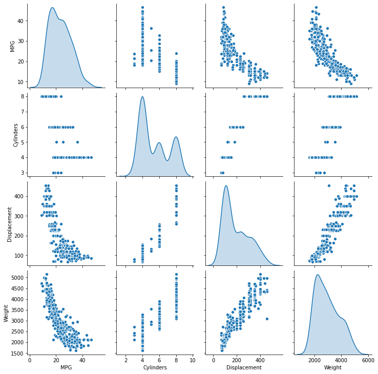
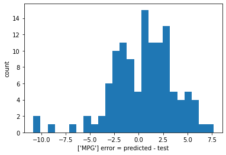

# <font color='blue'>Week 8 - Machine Learning Intro</font>

### <font color='red'> Used: Python and its libraries; NumPy and Pandas library. Google Colaboratory and Jupyter Notebook. </font>


**Agenda: Linear Regression on google colab**


```python
import pandas as pd
import matplotlib.pyplot as matpltlibpyplt
%matplotlib inline
```

**Uploading the file from your local disk**


```python
from google.colab import files
uploaded = files.upload()
```


     <input type="file" id="files-208c1664-9a3d-4aef-9b01-de6f8f8edfee" name="files[]" multiple disabled />
     <output id="result-208c1664-9a3d-4aef-9b01-de6f8f8edfee">
      Upload widget is only available when the cell has been executed in the
      current browser session. Please rerun this cell to enable.
      </output>
      <script src="/nbextensions/google.colab/files.js"></script> 


    Saving auto-mpg.data to auto-mpg (3).data
    

**Add the column names ['MPG','Cylinders','Displacement','Horsepower', Weight', 'Acceleration', 'Model Year', 'Origin'] to the read dataframe**


```python
column_names = ['MPG','Cylinders','Displacement','Horsepower','Weight',
                'Acceleration', 'Model Year', 'Origin']
df = pd.read_csv('auto-mpg.data', names=column_names,
                      na_values = "?", comment='\t',
                      sep=" ", skipinitialspace=True)
```


```python
df.sample(5)
```


<div>
<style scoped>
    .dataframe tbody tr th:only-of-type {
        vertical-align: middle;
    }

    .dataframe tbody tr th {
        vertical-align: top;
    }

    .dataframe thead th {
        text-align: right;
    }
</style>
<table border="1" class="dataframe">
  <thead>
    <tr style="text-align: right;">
      <th></th>
      <th>MPG</th>
      <th>Cylinders</th>
      <th>Displacement</th>
      <th>Horsepower</th>
      <th>Weight</th>
      <th>Acceleration</th>
      <th>Model Year</th>
      <th>Origin</th>
    </tr>
  </thead>
  <tbody>
    <tr>
      <th>62</th>
      <td>13.0</td>
      <td>8</td>
      <td>350.0</td>
      <td>165.0</td>
      <td>4274.0</td>
      <td>12.0</td>
      <td>72</td>
      <td>1</td>
    </tr>
    <tr>
      <th>328</th>
      <td>30.0</td>
      <td>4</td>
      <td>146.0</td>
      <td>67.0</td>
      <td>3250.0</td>
      <td>21.8</td>
      <td>80</td>
      <td>2</td>
    </tr>
    <tr>
      <th>270</th>
      <td>21.1</td>
      <td>4</td>
      <td>134.0</td>
      <td>95.0</td>
      <td>2515.0</td>
      <td>14.8</td>
      <td>78</td>
      <td>3</td>
    </tr>
    <tr>
      <th>119</th>
      <td>20.0</td>
      <td>4</td>
      <td>114.0</td>
      <td>91.0</td>
      <td>2582.0</td>
      <td>14.0</td>
      <td>73</td>
      <td>2</td>
    </tr>
    <tr>
      <th>274</th>
      <td>20.3</td>
      <td>5</td>
      <td>131.0</td>
      <td>103.0</td>
      <td>2830.0</td>
      <td>15.9</td>
      <td>78</td>
      <td>2</td>
    </tr>
  </tbody>
</table>
</div>


**Print all columns**


O/P is:
 Index(['MPG', 'Cylinders', 'Displacement', 'Horsepower', 'Weight',
      'Acceleration', 'Model Year', 'Origin'],
      dtype='object')


```python
df.columns
df.columns.values
```


    array(['MPG', 'Cylinders', 'Displacement', 'Horsepower', 'Weight',
           'Acceleration', 'Model Year', 'Origin'], dtype=object)


o/p is (398, 8)


```python
df.shape
```


    (398, 8)


o/p is 
<class 'pandas.core.frame.DataFrame'>
RangeIndex: 398 entries, 0 to 397
Data columns (total 8 columns):
MPG             398 non-null float64
Cylinders       398 non-null int64
Displacement    398 non-null float64
Horsepower      392 non-null float64
Weight          398 non-null float64
Acceleration    398 non-null float64
Model Year      398 non-null int64
Origin          398 non-null int64
dtypes: float64(5), int64(3)
memory usage: 25.0 KB


```python
df.info()
```

    <class 'pandas.core.frame.DataFrame'>
    RangeIndex: 398 entries, 0 to 397
    Data columns (total 8 columns):
    MPG             398 non-null float64
    Cylinders       398 non-null int64
    Displacement    398 non-null float64
    Horsepower      392 non-null float64
    Weight          398 non-null float64
    Acceleration    398 non-null float64
    Model Year      398 non-null int64
    Origin          398 non-null int64
    dtypes: float64(5), int64(3)
    memory usage: 25.0 KB
    


```python
df.Horsepower.count()
```


    392


```python
df.isna().sum()
```


    MPG             0
    Cylinders       0
    Displacement    0
    Horsepower      6
    Weight          0
    Acceleration    0
    Model Year      0
    Origin          0
    dtype: int64


```python
df.isna().iloc[:,[3]].sum()
```


    Horsepower    6
    dtype: int64


Select all the rows, and 4th, 5th and 7th column:
df.iloc[:,[3,4,6].head(5)


https://www.kdnuggets.com/2019/06/select-rows-columns-pandas.html


```python
df.iloc[:,[3]].isna().sum()

```


    Horsepower    6
    dtype: int64


replace these 6 value to "mean value" by:


```python
df.iloc[:,[3]]
```


<div>
<style scoped>
    .dataframe tbody tr th:only-of-type {
        vertical-align: middle;
    }

    .dataframe tbody tr th {
        vertical-align: top;
    }

    .dataframe thead th {
        text-align: right;
    }
</style>
<table border="1" class="dataframe">
  <thead>
    <tr style="text-align: right;">
      <th></th>
      <th>Horsepower</th>
    </tr>
  </thead>
  <tbody>
    <tr>
      <th>0</th>
      <td>130.0</td>
    </tr>
    <tr>
      <th>1</th>
      <td>165.0</td>
    </tr>
    <tr>
      <th>2</th>
      <td>150.0</td>
    </tr>
    <tr>
      <th>3</th>
      <td>150.0</td>
    </tr>
    <tr>
      <th>4</th>
      <td>140.0</td>
    </tr>
    <tr>
      <th>...</th>
      <td>...</td>
    </tr>
    <tr>
      <th>393</th>
      <td>86.0</td>
    </tr>
    <tr>
      <th>394</th>
      <td>52.0</td>
    </tr>
    <tr>
      <th>395</th>
      <td>84.0</td>
    </tr>
    <tr>
      <th>396</th>
      <td>79.0</td>
    </tr>
    <tr>
      <th>397</th>
      <td>82.0</td>
    </tr>
  </tbody>
</table>
<p>398 rows × 1 columns</p>
</div>


```python
# fill missing values with mean column values
# df.fillna(dataset.mean(), inplace=True)
```


**Fill the Horsepower missing records with median of the column**

ref: https://machinelearningmastery.com/handle-missing-data-python/


```python
# mark zero values as missing or NaN
# dataset[[1,2,3,4,5]] = dataset[[1,2,3,4,5]].replace(0, numpy.NaN)
# fill missing values with mean column values
df.fillna(df.mean(), inplace=True)

```


```python
df.iloc[:,[3]].isna().sum() #success all 6 empty filled up.
```


    Horsepower    0
    dtype: int64


O/P must be:

<class 'pandas.core.frame.DataFrame'>
RangeIndex: 398 entries, 0 to 397
Data columns (total 8 columns):
MPG             398 non-null float64
Cylinders       398 non-null int64
Displacement    398 non-null float64
Horsepower      398 non-null float64
Weight          398 non-null float64
Acceleration    398 non-null float64
Model Year      398 non-null int64
Origin          398 non-null int64
dtypes: float64(5), int64(3)
memory usage: 25.0 KB


```python
df.info()
```

    <class 'pandas.core.frame.DataFrame'>
    RangeIndex: 398 entries, 0 to 397
    Data columns (total 8 columns):
    MPG             398 non-null float64
    Cylinders       398 non-null int64
    Displacement    398 non-null float64
    Horsepower      398 non-null float64
    Weight          398 non-null float64
    Acceleration    398 non-null float64
    Model Year      398 non-null int64
    Origin          398 non-null int64
    dtypes: float64(5), int64(3)
    memory usage: 25.0 KB
    

O/P must be:

	MPG	Cylinders	Displacement	Horsepower	Weight	Acceleration	Model Year	Origin
0	18.0	8	307.0	130.0	3504.0	12.0	70	1
1	15.0	8	350.0	165.0	3693.0	11.5	70	1
2	18.0	8	318.0	150.0	3436.0	11.0	70	1
3	16.0	8	304.0	150.0	3433.0	12.0	70	1
4	17.0	8	302.0	140.0	3449.0	10.5	70	1


```python
#original df is like:
df.head(5)
```


<div>
<style scoped>
    .dataframe tbody tr th:only-of-type {
        vertical-align: middle;
    }

    .dataframe tbody tr th {
        vertical-align: top;
    }

    .dataframe thead th {
        text-align: right;
    }
</style>
<table border="1" class="dataframe">
  <thead>
    <tr style="text-align: right;">
      <th></th>
      <th>MPG</th>
      <th>Cylinders</th>
      <th>Displacement</th>
      <th>Horsepower</th>
      <th>Weight</th>
      <th>Acceleration</th>
      <th>Model Year</th>
      <th>Origin</th>
    </tr>
  </thead>
  <tbody>
    <tr>
      <th>0</th>
      <td>18.0</td>
      <td>8</td>
      <td>307.0</td>
      <td>130.0</td>
      <td>3504.0</td>
      <td>12.0</td>
      <td>70</td>
      <td>1</td>
    </tr>
    <tr>
      <th>1</th>
      <td>15.0</td>
      <td>8</td>
      <td>350.0</td>
      <td>165.0</td>
      <td>3693.0</td>
      <td>11.5</td>
      <td>70</td>
      <td>1</td>
    </tr>
    <tr>
      <th>2</th>
      <td>18.0</td>
      <td>8</td>
      <td>318.0</td>
      <td>150.0</td>
      <td>3436.0</td>
      <td>11.0</td>
      <td>70</td>
      <td>1</td>
    </tr>
    <tr>
      <th>3</th>
      <td>16.0</td>
      <td>8</td>
      <td>304.0</td>
      <td>150.0</td>
      <td>3433.0</td>
      <td>12.0</td>
      <td>70</td>
      <td>1</td>
    </tr>
    <tr>
      <th>4</th>
      <td>17.0</td>
      <td>8</td>
      <td>302.0</td>
      <td>140.0</td>
      <td>3449.0</td>
      <td>10.5</td>
      <td>70</td>
      <td>1</td>
    </tr>
  </tbody>
</table>
</div>


**Add 3 columns for the 'Origin' column in the dataset by mapping 1 to 'USA', 2 to 'Europe' and 3 to 'Japan'**


```python
df['Origin'] = df['Origin'].map({1: 'USA', 2: 'Europe', 3: 'Japan'}) 
df = pd.get_dummies(df, prefix='', prefix_sep='')
```


```python
df.head()
```


<div>
<style scoped>
    .dataframe tbody tr th:only-of-type {
        vertical-align: middle;
    }

    .dataframe tbody tr th {
        vertical-align: top;
    }

    .dataframe thead th {
        text-align: right;
    }
</style>
<table border="1" class="dataframe">
  <thead>
    <tr style="text-align: right;">
      <th></th>
      <th>MPG</th>
      <th>Cylinders</th>
      <th>Displacement</th>
      <th>Horsepower</th>
      <th>Weight</th>
      <th>Acceleration</th>
      <th>Model Year</th>
      <th>Europe</th>
      <th>Japan</th>
      <th>USA</th>
    </tr>
  </thead>
  <tbody>
    <tr>
      <th>0</th>
      <td>18.0</td>
      <td>8</td>
      <td>307.0</td>
      <td>130.0</td>
      <td>3504.0</td>
      <td>12.0</td>
      <td>70</td>
      <td>0</td>
      <td>0</td>
      <td>1</td>
    </tr>
    <tr>
      <th>1</th>
      <td>15.0</td>
      <td>8</td>
      <td>350.0</td>
      <td>165.0</td>
      <td>3693.0</td>
      <td>11.5</td>
      <td>70</td>
      <td>0</td>
      <td>0</td>
      <td>1</td>
    </tr>
    <tr>
      <th>2</th>
      <td>18.0</td>
      <td>8</td>
      <td>318.0</td>
      <td>150.0</td>
      <td>3436.0</td>
      <td>11.0</td>
      <td>70</td>
      <td>0</td>
      <td>0</td>
      <td>1</td>
    </tr>
    <tr>
      <th>3</th>
      <td>16.0</td>
      <td>8</td>
      <td>304.0</td>
      <td>150.0</td>
      <td>3433.0</td>
      <td>12.0</td>
      <td>70</td>
      <td>0</td>
      <td>0</td>
      <td>1</td>
    </tr>
    <tr>
      <th>4</th>
      <td>17.0</td>
      <td>8</td>
      <td>302.0</td>
      <td>140.0</td>
      <td>3449.0</td>
      <td>10.5</td>
      <td>70</td>
      <td>0</td>
      <td>0</td>
      <td>1</td>
    </tr>
  </tbody>
</table>
</div>


```python
df.tail()
```


<div>
<style scoped>
    .dataframe tbody tr th:only-of-type {
        vertical-align: middle;
    }

    .dataframe tbody tr th {
        vertical-align: top;
    }

    .dataframe thead th {
        text-align: right;
    }
</style>
<table border="1" class="dataframe">
  <thead>
    <tr style="text-align: right;">
      <th></th>
      <th>MPG</th>
      <th>Cylinders</th>
      <th>Displacement</th>
      <th>Horsepower</th>
      <th>Weight</th>
      <th>Acceleration</th>
      <th>Model Year</th>
      <th>Europe</th>
      <th>Japan</th>
      <th>USA</th>
    </tr>
  </thead>
  <tbody>
    <tr>
      <th>393</th>
      <td>27.0</td>
      <td>4</td>
      <td>140.0</td>
      <td>86.0</td>
      <td>2790.0</td>
      <td>15.6</td>
      <td>82</td>
      <td>0</td>
      <td>0</td>
      <td>1</td>
    </tr>
    <tr>
      <th>394</th>
      <td>44.0</td>
      <td>4</td>
      <td>97.0</td>
      <td>52.0</td>
      <td>2130.0</td>
      <td>24.6</td>
      <td>82</td>
      <td>1</td>
      <td>0</td>
      <td>0</td>
    </tr>
    <tr>
      <th>395</th>
      <td>32.0</td>
      <td>4</td>
      <td>135.0</td>
      <td>84.0</td>
      <td>2295.0</td>
      <td>11.6</td>
      <td>82</td>
      <td>0</td>
      <td>0</td>
      <td>1</td>
    </tr>
    <tr>
      <th>396</th>
      <td>28.0</td>
      <td>4</td>
      <td>120.0</td>
      <td>79.0</td>
      <td>2625.0</td>
      <td>18.6</td>
      <td>82</td>
      <td>0</td>
      <td>0</td>
      <td>1</td>
    </tr>
    <tr>
      <th>397</th>
      <td>31.0</td>
      <td>4</td>
      <td>119.0</td>
      <td>82.0</td>
      <td>2720.0</td>
      <td>19.4</td>
      <td>82</td>
      <td>0</td>
      <td>0</td>
      <td>1</td>
    </tr>
  </tbody>
</table>
</div>


O/P must be : Index(['MPG', 'Cylinders', 'Displacement', 'Horsepower', 'Weight',
       'Acceleration', 'Model Year', 'Europe', 'Japan', 'USA'],
      dtype='object')


```python
df.columns
```


    Index(['MPG', 'Cylinders', 'Displacement', 'Horsepower', 'Weight',
           'Acceleration', 'Model Year', 'Europe', 'Japan', 'USA'],
          dtype='object')


**Split the data in Y (MPG dependent variable and X (All other columns))**


```python
y=df.MPG
x=df.iloc[:,[1,2,3,4,5,6,7,8,9]]
```


```python
x.head()
```


<div>
<style scoped>
    .dataframe tbody tr th:only-of-type {
        vertical-align: middle;
    }

    .dataframe tbody tr th {
        vertical-align: top;
    }

    .dataframe thead th {
        text-align: right;
    }
</style>
<table border="1" class="dataframe">
  <thead>
    <tr style="text-align: right;">
      <th></th>
      <th>Cylinders</th>
      <th>Displacement</th>
      <th>Horsepower</th>
      <th>Weight</th>
      <th>Acceleration</th>
      <th>Model Year</th>
      <th>Europe</th>
      <th>Japan</th>
      <th>USA</th>
    </tr>
  </thead>
  <tbody>
    <tr>
      <th>0</th>
      <td>8</td>
      <td>307.0</td>
      <td>130.0</td>
      <td>3504.0</td>
      <td>12.0</td>
      <td>70</td>
      <td>0</td>
      <td>0</td>
      <td>1</td>
    </tr>
    <tr>
      <th>1</th>
      <td>8</td>
      <td>350.0</td>
      <td>165.0</td>
      <td>3693.0</td>
      <td>11.5</td>
      <td>70</td>
      <td>0</td>
      <td>0</td>
      <td>1</td>
    </tr>
    <tr>
      <th>2</th>
      <td>8</td>
      <td>318.0</td>
      <td>150.0</td>
      <td>3436.0</td>
      <td>11.0</td>
      <td>70</td>
      <td>0</td>
      <td>0</td>
      <td>1</td>
    </tr>
    <tr>
      <th>3</th>
      <td>8</td>
      <td>304.0</td>
      <td>150.0</td>
      <td>3433.0</td>
      <td>12.0</td>
      <td>70</td>
      <td>0</td>
      <td>0</td>
      <td>1</td>
    </tr>
    <tr>
      <th>4</th>
      <td>8</td>
      <td>302.0</td>
      <td>140.0</td>
      <td>3449.0</td>
      <td>10.5</td>
      <td>70</td>
      <td>0</td>
      <td>0</td>
      <td>1</td>
    </tr>
  </tbody>
</table>
</div>


```python
y.head()
```


    0    18.0
    1    15.0
    2    18.0
    3    16.0
    4    17.0
    Name: MPG, dtype: float64


```python
df
```


<div>
<style scoped>
    .dataframe tbody tr th:only-of-type {
        vertical-align: middle;
    }

    .dataframe tbody tr th {
        vertical-align: top;
    }

    .dataframe thead th {
        text-align: right;
    }
</style>
<table border="1" class="dataframe">
  <thead>
    <tr style="text-align: right;">
      <th></th>
      <th>MPG</th>
      <th>Cylinders</th>
      <th>Displacement</th>
      <th>Horsepower</th>
      <th>Weight</th>
      <th>Acceleration</th>
      <th>Model Year</th>
      <th>Europe</th>
      <th>Japan</th>
      <th>USA</th>
    </tr>
  </thead>
  <tbody>
    <tr>
      <th>0</th>
      <td>18.0</td>
      <td>8</td>
      <td>307.0</td>
      <td>130.0</td>
      <td>3504.0</td>
      <td>12.0</td>
      <td>70</td>
      <td>0</td>
      <td>0</td>
      <td>1</td>
    </tr>
    <tr>
      <th>1</th>
      <td>15.0</td>
      <td>8</td>
      <td>350.0</td>
      <td>165.0</td>
      <td>3693.0</td>
      <td>11.5</td>
      <td>70</td>
      <td>0</td>
      <td>0</td>
      <td>1</td>
    </tr>
    <tr>
      <th>2</th>
      <td>18.0</td>
      <td>8</td>
      <td>318.0</td>
      <td>150.0</td>
      <td>3436.0</td>
      <td>11.0</td>
      <td>70</td>
      <td>0</td>
      <td>0</td>
      <td>1</td>
    </tr>
    <tr>
      <th>3</th>
      <td>16.0</td>
      <td>8</td>
      <td>304.0</td>
      <td>150.0</td>
      <td>3433.0</td>
      <td>12.0</td>
      <td>70</td>
      <td>0</td>
      <td>0</td>
      <td>1</td>
    </tr>
    <tr>
      <th>4</th>
      <td>17.0</td>
      <td>8</td>
      <td>302.0</td>
      <td>140.0</td>
      <td>3449.0</td>
      <td>10.5</td>
      <td>70</td>
      <td>0</td>
      <td>0</td>
      <td>1</td>
    </tr>
    <tr>
      <th>...</th>
      <td>...</td>
      <td>...</td>
      <td>...</td>
      <td>...</td>
      <td>...</td>
      <td>...</td>
      <td>...</td>
      <td>...</td>
      <td>...</td>
      <td>...</td>
    </tr>
    <tr>
      <th>393</th>
      <td>27.0</td>
      <td>4</td>
      <td>140.0</td>
      <td>86.0</td>
      <td>2790.0</td>
      <td>15.6</td>
      <td>82</td>
      <td>0</td>
      <td>0</td>
      <td>1</td>
    </tr>
    <tr>
      <th>394</th>
      <td>44.0</td>
      <td>4</td>
      <td>97.0</td>
      <td>52.0</td>
      <td>2130.0</td>
      <td>24.6</td>
      <td>82</td>
      <td>1</td>
      <td>0</td>
      <td>0</td>
    </tr>
    <tr>
      <th>395</th>
      <td>32.0</td>
      <td>4</td>
      <td>135.0</td>
      <td>84.0</td>
      <td>2295.0</td>
      <td>11.6</td>
      <td>82</td>
      <td>0</td>
      <td>0</td>
      <td>1</td>
    </tr>
    <tr>
      <th>396</th>
      <td>28.0</td>
      <td>4</td>
      <td>120.0</td>
      <td>79.0</td>
      <td>2625.0</td>
      <td>18.6</td>
      <td>82</td>
      <td>0</td>
      <td>0</td>
      <td>1</td>
    </tr>
    <tr>
      <th>397</th>
      <td>31.0</td>
      <td>4</td>
      <td>119.0</td>
      <td>82.0</td>
      <td>2720.0</td>
      <td>19.4</td>
      <td>82</td>
      <td>0</td>
      <td>0</td>
      <td>1</td>
    </tr>
  </tbody>
</table>
<p>398 rows × 10 columns</p>
</div>


### **Split the data**

**Split the data in training and testing** 


```python
#no need)
#new way as per Module-8.ipynb
```


```python
#no need 
train_dataset = df.sample(frac=0.8,random_state=1029)
test_dataset = df.drop(train_dataset.index) # INDEX is 1st line already exist see above sample of df.
```


```python
from sklearn.model_selection import train_test_split
```


```python
# Train the model using the training sets

x_train, x_test, y_train, y_test = train_test_split(x,y,test_size = 0.3, random_state=1029)
```

### **Inspect the data**


```python
import seaborn
```


```python
seaborn.pairplot(train_dataset[["MPG", "Cylinders", "Displacement", "Weight"]], diag_kind="kde") 
```


    <seaborn.axisgrid.PairGrid at 0x7f0b4462f470>





```python
df.describe()
```


<div>
<style scoped>
    .dataframe tbody tr th:only-of-type {
        vertical-align: middle;
    }

    .dataframe tbody tr th {
        vertical-align: top;
    }

    .dataframe thead th {
        text-align: right;
    }
</style>
<table border="1" class="dataframe">
  <thead>
    <tr style="text-align: right;">
      <th></th>
      <th>MPG</th>
      <th>Cylinders</th>
      <th>Displacement</th>
      <th>Horsepower</th>
      <th>Weight</th>
      <th>Acceleration</th>
      <th>Model Year</th>
      <th>Europe</th>
      <th>Japan</th>
      <th>USA</th>
    </tr>
  </thead>
  <tbody>
    <tr>
      <th>count</th>
      <td>398.000000</td>
      <td>398.000000</td>
      <td>398.000000</td>
      <td>398.000000</td>
      <td>398.000000</td>
      <td>398.000000</td>
      <td>398.000000</td>
      <td>398.000000</td>
      <td>398.000000</td>
      <td>398.000000</td>
    </tr>
    <tr>
      <th>mean</th>
      <td>23.514573</td>
      <td>5.454774</td>
      <td>193.425879</td>
      <td>104.469388</td>
      <td>2970.424623</td>
      <td>15.568090</td>
      <td>76.010050</td>
      <td>0.175879</td>
      <td>0.198492</td>
      <td>0.625628</td>
    </tr>
    <tr>
      <th>std</th>
      <td>7.815984</td>
      <td>1.701004</td>
      <td>104.269838</td>
      <td>38.199187</td>
      <td>846.841774</td>
      <td>2.757689</td>
      <td>3.697627</td>
      <td>0.381197</td>
      <td>0.399367</td>
      <td>0.484569</td>
    </tr>
    <tr>
      <th>min</th>
      <td>9.000000</td>
      <td>3.000000</td>
      <td>68.000000</td>
      <td>46.000000</td>
      <td>1613.000000</td>
      <td>8.000000</td>
      <td>70.000000</td>
      <td>0.000000</td>
      <td>0.000000</td>
      <td>0.000000</td>
    </tr>
    <tr>
      <th>25%</th>
      <td>17.500000</td>
      <td>4.000000</td>
      <td>104.250000</td>
      <td>76.000000</td>
      <td>2223.750000</td>
      <td>13.825000</td>
      <td>73.000000</td>
      <td>0.000000</td>
      <td>0.000000</td>
      <td>0.000000</td>
    </tr>
    <tr>
      <th>50%</th>
      <td>23.000000</td>
      <td>4.000000</td>
      <td>148.500000</td>
      <td>95.000000</td>
      <td>2803.500000</td>
      <td>15.500000</td>
      <td>76.000000</td>
      <td>0.000000</td>
      <td>0.000000</td>
      <td>1.000000</td>
    </tr>
    <tr>
      <th>75%</th>
      <td>29.000000</td>
      <td>8.000000</td>
      <td>262.000000</td>
      <td>125.000000</td>
      <td>3608.000000</td>
      <td>17.175000</td>
      <td>79.000000</td>
      <td>0.000000</td>
      <td>0.000000</td>
      <td>1.000000</td>
    </tr>
    <tr>
      <th>max</th>
      <td>46.600000</td>
      <td>8.000000</td>
      <td>455.000000</td>
      <td>230.000000</td>
      <td>5140.000000</td>
      <td>24.800000</td>
      <td>82.000000</td>
      <td>1.000000</td>
      <td>1.000000</td>
      <td>1.000000</td>
    </tr>
  </tbody>
</table>
</div>


```python
test_dataset.describe()
```


<div>
<style scoped>
    .dataframe tbody tr th:only-of-type {
        vertical-align: middle;
    }

    .dataframe tbody tr th {
        vertical-align: top;
    }

    .dataframe thead th {
        text-align: right;
    }
</style>
<table border="1" class="dataframe">
  <thead>
    <tr style="text-align: right;">
      <th></th>
      <th>MPG</th>
      <th>Cylinders</th>
      <th>Displacement</th>
      <th>Horsepower</th>
      <th>Weight</th>
      <th>Acceleration</th>
      <th>Model Year</th>
      <th>Europe</th>
      <th>Japan</th>
      <th>USA</th>
    </tr>
  </thead>
  <tbody>
    <tr>
      <th>count</th>
      <td>80.000000</td>
      <td>80.000000</td>
      <td>80.000000</td>
      <td>80.000000</td>
      <td>80.00000</td>
      <td>80.000000</td>
      <td>80.000000</td>
      <td>80.000000</td>
      <td>80.000000</td>
      <td>80.00000</td>
    </tr>
    <tr>
      <th>mean</th>
      <td>23.791250</td>
      <td>5.500000</td>
      <td>189.037500</td>
      <td>101.437500</td>
      <td>2933.38750</td>
      <td>15.817500</td>
      <td>76.225000</td>
      <td>0.150000</td>
      <td>0.262500</td>
      <td>0.58750</td>
    </tr>
    <tr>
      <th>std</th>
      <td>7.452265</td>
      <td>1.728393</td>
      <td>99.409706</td>
      <td>34.649728</td>
      <td>802.29223</td>
      <td>2.665997</td>
      <td>3.645615</td>
      <td>0.359324</td>
      <td>0.442769</td>
      <td>0.49539</td>
    </tr>
    <tr>
      <th>min</th>
      <td>11.000000</td>
      <td>4.000000</td>
      <td>78.000000</td>
      <td>46.000000</td>
      <td>1795.00000</td>
      <td>8.000000</td>
      <td>70.000000</td>
      <td>0.000000</td>
      <td>0.000000</td>
      <td>0.00000</td>
    </tr>
    <tr>
      <th>25%</th>
      <td>18.750000</td>
      <td>4.000000</td>
      <td>107.000000</td>
      <td>75.000000</td>
      <td>2285.50000</td>
      <td>14.000000</td>
      <td>73.000000</td>
      <td>0.000000</td>
      <td>0.000000</td>
      <td>0.00000</td>
    </tr>
    <tr>
      <th>50%</th>
      <td>22.500000</td>
      <td>4.000000</td>
      <td>146.000000</td>
      <td>91.500000</td>
      <td>2802.50000</td>
      <td>15.500000</td>
      <td>76.000000</td>
      <td>0.000000</td>
      <td>0.000000</td>
      <td>1.00000</td>
    </tr>
    <tr>
      <th>75%</th>
      <td>29.000000</td>
      <td>8.000000</td>
      <td>302.000000</td>
      <td>121.250000</td>
      <td>3553.50000</td>
      <td>17.700000</td>
      <td>79.000000</td>
      <td>0.000000</td>
      <td>1.000000</td>
      <td>1.00000</td>
    </tr>
    <tr>
      <th>max</th>
      <td>43.100000</td>
      <td>8.000000</td>
      <td>429.000000</td>
      <td>208.000000</td>
      <td>4633.00000</td>
      <td>21.800000</td>
      <td>82.000000</td>
      <td>1.000000</td>
      <td>1.000000</td>
      <td>1.00000</td>
    </tr>
  </tbody>
</table>
</div>


```python
train_dataset.describe()
```


<div>
<style scoped>
    .dataframe tbody tr th:only-of-type {
        vertical-align: middle;
    }

    .dataframe tbody tr th {
        vertical-align: top;
    }

    .dataframe thead th {
        text-align: right;
    }
</style>
<table border="1" class="dataframe">
  <thead>
    <tr style="text-align: right;">
      <th></th>
      <th>MPG</th>
      <th>Cylinders</th>
      <th>Displacement</th>
      <th>Horsepower</th>
      <th>Weight</th>
      <th>Acceleration</th>
      <th>Model Year</th>
      <th>Europe</th>
      <th>Japan</th>
      <th>USA</th>
    </tr>
  </thead>
  <tbody>
    <tr>
      <th>count</th>
      <td>318.000000</td>
      <td>318.000000</td>
      <td>318.000000</td>
      <td>318.000000</td>
      <td>318.000000</td>
      <td>318.000000</td>
      <td>318.000000</td>
      <td>318.000000</td>
      <td>318.000000</td>
      <td>318.000000</td>
    </tr>
    <tr>
      <th>mean</th>
      <td>23.444969</td>
      <td>5.443396</td>
      <td>194.529874</td>
      <td>105.232127</td>
      <td>2979.742138</td>
      <td>15.505346</td>
      <td>75.955975</td>
      <td>0.182390</td>
      <td>0.182390</td>
      <td>0.635220</td>
    </tr>
    <tr>
      <th>std</th>
      <td>7.914676</td>
      <td>1.696611</td>
      <td>105.579876</td>
      <td>39.055310</td>
      <td>858.649576</td>
      <td>2.780850</td>
      <td>3.714319</td>
      <td>0.386774</td>
      <td>0.386774</td>
      <td>0.482127</td>
    </tr>
    <tr>
      <th>min</th>
      <td>9.000000</td>
      <td>3.000000</td>
      <td>68.000000</td>
      <td>46.000000</td>
      <td>1613.000000</td>
      <td>8.500000</td>
      <td>70.000000</td>
      <td>0.000000</td>
      <td>0.000000</td>
      <td>0.000000</td>
    </tr>
    <tr>
      <th>25%</th>
      <td>17.000000</td>
      <td>4.000000</td>
      <td>101.750000</td>
      <td>76.000000</td>
      <td>2220.000000</td>
      <td>13.525000</td>
      <td>73.000000</td>
      <td>0.000000</td>
      <td>0.000000</td>
      <td>0.000000</td>
    </tr>
    <tr>
      <th>50%</th>
      <td>23.000000</td>
      <td>4.000000</td>
      <td>151.000000</td>
      <td>95.000000</td>
      <td>2803.500000</td>
      <td>15.450000</td>
      <td>76.000000</td>
      <td>0.000000</td>
      <td>0.000000</td>
      <td>1.000000</td>
    </tr>
    <tr>
      <th>75%</th>
      <td>29.000000</td>
      <td>8.000000</td>
      <td>260.000000</td>
      <td>125.000000</td>
      <td>3611.000000</td>
      <td>17.000000</td>
      <td>79.000000</td>
      <td>0.000000</td>
      <td>0.000000</td>
      <td>1.000000</td>
    </tr>
    <tr>
      <th>max</th>
      <td>46.600000</td>
      <td>8.000000</td>
      <td>455.000000</td>
      <td>230.000000</td>
      <td>5140.000000</td>
      <td>24.800000</td>
      <td>82.000000</td>
      <td>1.000000</td>
      <td>1.000000</td>
      <td>1.000000</td>
    </tr>
  </tbody>
</table>
</div>


```python
temp_view_stat = train_dataset.describe()
temp_view_stat.transpose()
```


<div>
<style scoped>
    .dataframe tbody tr th:only-of-type {
        vertical-align: middle;
    }

    .dataframe tbody tr th {
        vertical-align: top;
    }

    .dataframe thead th {
        text-align: right;
    }
</style>
<table border="1" class="dataframe">
  <thead>
    <tr style="text-align: right;">
      <th></th>
      <th>count</th>
      <th>mean</th>
      <th>std</th>
      <th>min</th>
      <th>25%</th>
      <th>50%</th>
      <th>75%</th>
      <th>max</th>
    </tr>
  </thead>
  <tbody>
    <tr>
      <th>MPG</th>
      <td>318.0</td>
      <td>23.444969</td>
      <td>7.914676</td>
      <td>9.0</td>
      <td>17.000</td>
      <td>23.00</td>
      <td>29.0</td>
      <td>46.6</td>
    </tr>
    <tr>
      <th>Cylinders</th>
      <td>318.0</td>
      <td>5.443396</td>
      <td>1.696611</td>
      <td>3.0</td>
      <td>4.000</td>
      <td>4.00</td>
      <td>8.0</td>
      <td>8.0</td>
    </tr>
    <tr>
      <th>Displacement</th>
      <td>318.0</td>
      <td>194.529874</td>
      <td>105.579876</td>
      <td>68.0</td>
      <td>101.750</td>
      <td>151.00</td>
      <td>260.0</td>
      <td>455.0</td>
    </tr>
    <tr>
      <th>Horsepower</th>
      <td>318.0</td>
      <td>105.232127</td>
      <td>39.055310</td>
      <td>46.0</td>
      <td>76.000</td>
      <td>95.00</td>
      <td>125.0</td>
      <td>230.0</td>
    </tr>
    <tr>
      <th>Weight</th>
      <td>318.0</td>
      <td>2979.742138</td>
      <td>858.649576</td>
      <td>1613.0</td>
      <td>2220.000</td>
      <td>2803.50</td>
      <td>3611.0</td>
      <td>5140.0</td>
    </tr>
    <tr>
      <th>Acceleration</th>
      <td>318.0</td>
      <td>15.505346</td>
      <td>2.780850</td>
      <td>8.5</td>
      <td>13.525</td>
      <td>15.45</td>
      <td>17.0</td>
      <td>24.8</td>
    </tr>
    <tr>
      <th>Model Year</th>
      <td>318.0</td>
      <td>75.955975</td>
      <td>3.714319</td>
      <td>70.0</td>
      <td>73.000</td>
      <td>76.00</td>
      <td>79.0</td>
      <td>82.0</td>
    </tr>
    <tr>
      <th>Europe</th>
      <td>318.0</td>
      <td>0.182390</td>
      <td>0.386774</td>
      <td>0.0</td>
      <td>0.000</td>
      <td>0.00</td>
      <td>0.0</td>
      <td>1.0</td>
    </tr>
    <tr>
      <th>Japan</th>
      <td>318.0</td>
      <td>0.182390</td>
      <td>0.386774</td>
      <td>0.0</td>
      <td>0.000</td>
      <td>0.00</td>
      <td>0.0</td>
      <td>1.0</td>
    </tr>
    <tr>
      <th>USA</th>
      <td>318.0</td>
      <td>0.635220</td>
      <td>0.482127</td>
      <td>0.0</td>
      <td>0.000</td>
      <td>1.00</td>
      <td>1.0</td>
      <td>1.0</td>
    </tr>
  </tbody>
</table>
</div>


```python
temp1_view_stat = train_dataset.describe()

temp2_view_stat = temp1_view_stat.drop(columns='MPG')
temp2_view_stat =  temp2_view_stat.transpose()

temp2_view_stat
```


<div>
<style scoped>
    .dataframe tbody tr th:only-of-type {
        vertical-align: middle;
    }

    .dataframe tbody tr th {
        vertical-align: top;
    }

    .dataframe thead th {
        text-align: right;
    }
</style>
<table border="1" class="dataframe">
  <thead>
    <tr style="text-align: right;">
      <th></th>
      <th>count</th>
      <th>mean</th>
      <th>std</th>
      <th>min</th>
      <th>25%</th>
      <th>50%</th>
      <th>75%</th>
      <th>max</th>
    </tr>
  </thead>
  <tbody>
    <tr>
      <th>Cylinders</th>
      <td>318.0</td>
      <td>5.443396</td>
      <td>1.696611</td>
      <td>3.0</td>
      <td>4.000</td>
      <td>4.00</td>
      <td>8.0</td>
      <td>8.0</td>
    </tr>
    <tr>
      <th>Displacement</th>
      <td>318.0</td>
      <td>194.529874</td>
      <td>105.579876</td>
      <td>68.0</td>
      <td>101.750</td>
      <td>151.00</td>
      <td>260.0</td>
      <td>455.0</td>
    </tr>
    <tr>
      <th>Horsepower</th>
      <td>318.0</td>
      <td>105.232127</td>
      <td>39.055310</td>
      <td>46.0</td>
      <td>76.000</td>
      <td>95.00</td>
      <td>125.0</td>
      <td>230.0</td>
    </tr>
    <tr>
      <th>Weight</th>
      <td>318.0</td>
      <td>2979.742138</td>
      <td>858.649576</td>
      <td>1613.0</td>
      <td>2220.000</td>
      <td>2803.50</td>
      <td>3611.0</td>
      <td>5140.0</td>
    </tr>
    <tr>
      <th>Acceleration</th>
      <td>318.0</td>
      <td>15.505346</td>
      <td>2.780850</td>
      <td>8.5</td>
      <td>13.525</td>
      <td>15.45</td>
      <td>17.0</td>
      <td>24.8</td>
    </tr>
    <tr>
      <th>Model Year</th>
      <td>318.0</td>
      <td>75.955975</td>
      <td>3.714319</td>
      <td>70.0</td>
      <td>73.000</td>
      <td>76.00</td>
      <td>79.0</td>
      <td>82.0</td>
    </tr>
    <tr>
      <th>Europe</th>
      <td>318.0</td>
      <td>0.182390</td>
      <td>0.386774</td>
      <td>0.0</td>
      <td>0.000</td>
      <td>0.00</td>
      <td>0.0</td>
      <td>1.0</td>
    </tr>
    <tr>
      <th>Japan</th>
      <td>318.0</td>
      <td>0.182390</td>
      <td>0.386774</td>
      <td>0.0</td>
      <td>0.000</td>
      <td>0.00</td>
      <td>0.0</td>
      <td>1.0</td>
    </tr>
    <tr>
      <th>USA</th>
      <td>318.0</td>
      <td>0.635220</td>
      <td>0.482127</td>
      <td>0.0</td>
      <td>0.000</td>
      <td>1.00</td>
      <td>1.0</td>
      <td>1.0</td>
    </tr>
  </tbody>
</table>
</div>


```python
df.shape
```


    (398, 10)


```python
train_dataset.shape
```


    (318, 10)


```python
test_dataset.shape
```


    (80, 10)


### **Normalize the data**


```python
# normalization: This is the way it works interm so of calculation.
# normalization by definition/formula in Math. a-b / c

def norm(x):
  return (x - temp2_view_stat['mean']) / temp2_view_stat['std']  


normed_train_data = norm(train_dataset)
normed_test_data = norm(test_dataset)
```

### **Build the model**

Let's build our model using Keras Model Configuration: Neural Network API- Tensors flow

https://www.tensorflow.org/tutorials/keras/regression


https://datascienceplus.com/keras-regression-based-neural-networks/

https://scikit-learn.org/stable/auto_examples/linear_model/plot_ols.html#sphx-glr-auto-examples-linear-model-plot-ols-py


**Build Linear Regression Model and print Mean absolute error, Mean squared error and Prediction Error [MPG] like the lecture module**


```python
import tensorflow as tf

from tensorflow import keras
from tensorflow.keras import layers
```


```python
def build_model():
  model = keras.Sequential([
    layers.Dense(64, activation='relu', input_shape=[len(train_dataset.keys())]), # 64=neurons=graphical
    layers.Dense(64, activation='relu'),
    layers.Dense(1)
  ])

  optimizer = tf.keras.optimizers.RMSprop(0.001)

  model.compile(loss='mse',
                optimizer=optimizer,
                metrics=['mae', 'mse'])
  return model
```


```python
model = build_model()
```

## **Inspect the model**


```python
model.summary()
```

    Model: "sequential_1"
    _________________________________________________________________
    Layer (type)                 Output Shape              Param #   
    =================================================================
    dense_3 (Dense)              (None, 64)                704       
    _________________________________________________________________
    dense_4 (Dense)              (None, 64)                4160      
    _________________________________________________________________
    dense_5 (Dense)              (None, 1)                 65        
    =================================================================
    Total params: 4,929
    Trainable params: 4,929
    Non-trainable params: 0
    _________________________________________________________________
    


```python
example_batch = normed_train_data[:]
exmple_result=model.predict(example_batch)
exmple_result
```


    array([[nan],
           [nan],
           [nan],
           [nan],
           [nan],
           [nan],
           [nan],
           [nan],
           [nan],
           [nan],
           [nan],
           [nan],
           [nan],
           [nan],
           [nan],
           [nan],
           [nan],
           [nan],
           [nan],
           [nan],
           [nan],
           [nan],
           [nan],
           [nan],
           [nan],
           [nan],
           [nan],
           [nan],
           [nan],
           [nan],
           [nan],
           [nan],
           [nan],
           [nan],
           [nan],
           [nan],
           [nan],
           [nan],
           [nan],
           [nan],
           [nan],
           [nan],
           [nan],
           [nan],
           [nan],
           [nan],
           [nan],
           [nan],
           [nan],
           [nan],
           [nan],
           [nan],
           [nan],
           [nan],
           [nan],
           [nan],
           [nan],
           [nan],
           [nan],
           [nan],
           [nan],
           [nan],
           [nan],
           [nan],
           [nan],
           [nan],
           [nan],
           [nan],
           [nan],
           [nan],
           [nan],
           [nan],
           [nan],
           [nan],
           [nan],
           [nan],
           [nan],
           [nan],
           [nan],
           [nan],
           [nan],
           [nan],
           [nan],
           [nan],
           [nan],
           [nan],
           [nan],
           [nan],
           [nan],
           [nan],
           [nan],
           [nan],
           [nan],
           [nan],
           [nan],
           [nan],
           [nan],
           [nan],
           [nan],
           [nan],
           [nan],
           [nan],
           [nan],
           [nan],
           [nan],
           [nan],
           [nan],
           [nan],
           [nan],
           [nan],
           [nan],
           [nan],
           [nan],
           [nan],
           [nan],
           [nan],
           [nan],
           [nan],
           [nan],
           [nan],
           [nan],
           [nan],
           [nan],
           [nan],
           [nan],
           [nan],
           [nan],
           [nan],
           [nan],
           [nan],
           [nan],
           [nan],
           [nan],
           [nan],
           [nan],
           [nan],
           [nan],
           [nan],
           [nan],
           [nan],
           [nan],
           [nan],
           [nan],
           [nan],
           [nan],
           [nan],
           [nan],
           [nan],
           [nan],
           [nan],
           [nan],
           [nan],
           [nan],
           [nan],
           [nan],
           [nan],
           [nan],
           [nan],
           [nan],
           [nan],
           [nan],
           [nan],
           [nan],
           [nan],
           [nan],
           [nan],
           [nan],
           [nan],
           [nan],
           [nan],
           [nan],
           [nan],
           [nan],
           [nan],
           [nan],
           [nan],
           [nan],
           [nan],
           [nan],
           [nan],
           [nan],
           [nan],
           [nan],
           [nan],
           [nan],
           [nan],
           [nan],
           [nan],
           [nan],
           [nan],
           [nan],
           [nan],
           [nan],
           [nan],
           [nan],
           [nan],
           [nan],
           [nan],
           [nan],
           [nan],
           [nan],
           [nan],
           [nan],
           [nan],
           [nan],
           [nan],
           [nan],
           [nan],
           [nan],
           [nan],
           [nan],
           [nan],
           [nan],
           [nan],
           [nan],
           [nan],
           [nan],
           [nan],
           [nan],
           [nan],
           [nan],
           [nan],
           [nan],
           [nan],
           [nan],
           [nan],
           [nan],
           [nan],
           [nan],
           [nan],
           [nan],
           [nan],
           [nan],
           [nan],
           [nan],
           [nan],
           [nan],
           [nan],
           [nan],
           [nan],
           [nan],
           [nan],
           [nan],
           [nan],
           [nan],
           [nan],
           [nan],
           [nan],
           [nan],
           [nan],
           [nan],
           [nan],
           [nan],
           [nan],
           [nan],
           [nan],
           [nan],
           [nan],
           [nan],
           [nan],
           [nan],
           [nan],
           [nan],
           [nan],
           [nan],
           [nan],
           [nan],
           [nan],
           [nan],
           [nan],
           [nan],
           [nan],
           [nan],
           [nan],
           [nan],
           [nan],
           [nan],
           [nan],
           [nan],
           [nan],
           [nan],
           [nan],
           [nan],
           [nan],
           [nan],
           [nan],
           [nan],
           [nan],
           [nan],
           [nan],
           [nan],
           [nan],
           [nan],
           [nan],
           [nan],
           [nan],
           [nan],
           [nan],
           [nan],
           [nan],
           [nan],
           [nan],
           [nan],
           [nan],
           [nan],
           [nan],
           [nan],
           [nan],
           [nan],
           [nan],
           [nan],
           [nan],
           [nan],
           [nan],
           [nan],
           [nan],
           [nan],
           [nan]], dtype=float32)


```python
#Linear Regression in SKLearn
from sklearn.linear_model import LinearRegression
```


```python
# Create linear regression object
myLinReg = LinearRegression()


```


```python
# myLinReg = LinearRegression(copy_X=True, fit_intercept=True, n_jobs=None, normalize=True) 
# you can do false as well-for Normalization

myLinReg  ##myLinReg = LinearRegression(copy_X=True, fit_intercept=True, n_jobs=None, normalize=True) 
```


    LinearRegression(copy_X=True, fit_intercept=True, n_jobs=None, normalize=False)


```python
myLinReg.fit(x_train, y_train)

```


    LinearRegression(copy_X=True, fit_intercept=True, n_jobs=None, normalize=False)


```python
print("intercept is   : ", myLinReg.intercept_)
print("coefficient is : ", myLinReg.coef_)
```

    intercept is   :  -15.988782732565507
    coefficient is :  [-0.47517903  0.02792932 -0.01831079 -0.0071414   0.08557411  0.78273656
      0.85877417  1.12472308 -1.98349725]
    


```python
predict_price = myLinReg.predict(x_test)
predict_price
```


    array([28.05521657, 24.43734931, 27.18912283, 35.37653958, 25.93694673,
           14.6806393 , 33.52399243, 19.26613418, 25.44072758, 10.86078302,
           12.48365311,  7.91571846, 30.66882652, 20.24835724, 19.59847377,
           34.82787818, 21.70146718, 30.07272545, 28.72283263, 26.09383713,
           16.62058326, 31.90739199, 17.89347964, 25.51299553,  7.96281345,
           24.01441481, 11.92245101, 23.54004982, 31.08675515, 15.11879378,
           21.97325931, 34.89542476, 31.84124433, 26.34926313, 22.28253291,
           32.03496337, 19.80152637, 24.92240149, 30.73108734, 20.20504298,
           23.08954239, 21.23722709, 16.01285661, 18.23123293, 30.2648054 ,
           32.88042078, 30.79187915, 18.06193264, 33.44194011, 36.04502028,
           26.09774316, 16.69465036, 21.65997086, 22.18939316, 29.32243229,
            9.3420625 , 24.76211864, 26.76779308, 15.08807759, 20.38760933,
           26.94842764, 28.56649769, 27.90977958, 29.80616455, 16.90295522,
           20.42118796, 12.80075428, 28.88025146, 20.22409916, 30.22394088,
           23.98154869, 23.23942085, 30.6359471 , 18.94587596, 32.57584694,
           36.60938373, 23.76451849, 26.24175628, 24.80543294, 26.47072995,
           23.78747077, 23.75231171, 28.788951  , 17.18593152, 15.87951236,
           29.34222995, 15.2721873 , 26.17390711, 15.55619939, 21.90025549,
           26.67972075,  9.30360213, 17.02214975, 23.88761329, 31.9639931 ,
           22.70815344, 36.15359329, 22.66197865, 22.33117077, 28.90202895,
           20.96329105, 12.81812528, 34.19004995, 23.83189076, 25.15421017,
            6.08799023, 14.44750172, 34.52877691, 21.3473211 , 28.69464047,
           15.39708544, 16.39102313, 11.79675691, 10.1841416 , 20.48609938,
           23.46889474, 20.81252701, 26.31629714, 27.69059602, 22.87806734])


```python
x_test.head(3)
```


<div>
<style scoped>
    .dataframe tbody tr th:only-of-type {
        vertical-align: middle;
    }

    .dataframe tbody tr th {
        vertical-align: top;
    }

    .dataframe thead th {
        text-align: right;
    }
</style>
<table border="1" class="dataframe">
  <thead>
    <tr style="text-align: right;">
      <th></th>
      <th>Cylinders</th>
      <th>Displacement</th>
      <th>Horsepower</th>
      <th>Weight</th>
      <th>Acceleration</th>
      <th>Model Year</th>
      <th>Europe</th>
      <th>Japan</th>
      <th>USA</th>
    </tr>
  </thead>
  <tbody>
    <tr>
      <th>269</th>
      <td>4</td>
      <td>105.0</td>
      <td>75.0</td>
      <td>2230.0</td>
      <td>14.5</td>
      <td>78</td>
      <td>0</td>
      <td>0</td>
      <td>1</td>
    </tr>
    <tr>
      <th>254</th>
      <td>6</td>
      <td>200.0</td>
      <td>85.0</td>
      <td>2965.0</td>
      <td>15.8</td>
      <td>78</td>
      <td>0</td>
      <td>0</td>
      <td>1</td>
    </tr>
    <tr>
      <th>360</th>
      <td>6</td>
      <td>145.0</td>
      <td>76.0</td>
      <td>3160.0</td>
      <td>19.6</td>
      <td>81</td>
      <td>1</td>
      <td>0</td>
      <td>0</td>
    </tr>
  </tbody>
</table>
</div>


```python
y_test.head(3)
```


    269    30.9
    254    20.2
    360    30.7
    Name: MPG, dtype: float64


```python
from sklearn import metrics
```


```python
print("MSE: ",metrics.mean_squared_error(y_test,predict_price))
print("MAE: ",metrics.mean_absolute_error(y_test,predict_price))
```

    MSE:  10.622377260561644
    MAE:  2.5758705101444996
    


```python
# error how much?
```


```python
error = (predict_price-y_test)
error
```


    269   -2.844783
    254    4.237349
    360   -3.510877
    347   -1.623460
    29    -1.063053
             ...   
    179    1.468895
    174    2.812527
    185    0.316297
    196    3.190596
    49    -0.121933
    Name: MPG, Length: 120, dtype: float64


```python
#plot thr graph error vs count
```


```python
matpltlibpyplt.hist(error, bins=25)
matpltlibpyplt.xlabel("['MPG'] error = predicted - test")
matpltlibpyplt.ylabel("count")
```


    Text(0, 0.5, 'count')




