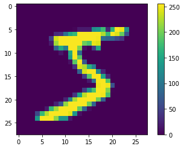
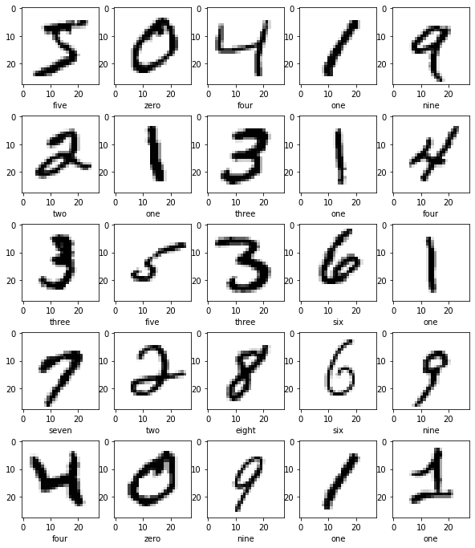

# <font color='blue'>Week 9 - Machine Learning Intro</font>

### <font color='red'> Used: Python and its libraries; NumPy and Pandas library. Jupyter Notebook. </font>
### <font color='red'> Used: Tensorsflow 2.x </font>


### We will use the famous data set MNIST for our lab

**Select TensorFlow 2 like the Lecture Module**


```python
%tensorflow_version 2.x
```

    TensorFlow 2.x selected.
    

**Import TensorFlow and other helper libraries**


```python
import tensorflow
from tensorflow import keras

import numpy
import matplotlib.pyplot as matPlotLibPyPlot

print(tensorflow.__version__)
```

    2.1.0
    

## Import the MNIST dataset


```python
my_mnist = keras.datasets.mnist
```

**Load the data in (train_images, train_labels), (test_images, test_labels)**


```python
(train_images, train_labels), (test_images, test_labels) = my_mnist.load_data()
```

    Downloading data from https://storage.googleapis.com/tensorflow/tf-keras-datasets/mnist.npz
    11493376/11490434 [==============================] - 0s 0us/step
    

**print the labels of numbers by printing the content of train_labels**


```python
train_labels
```


    array([5, 0, 4, ..., 5, 6, 8], dtype=uint8)


## Explore the data
Let's explore the format of the dataset before training the model. The following shows there are 60,000 images in the training set, with each image represented as 28 x 28 pixels:


```python
train_images.shape
```


    (60000, 28, 28)


**Likewise, there are 60,000 labels in the training set: Print the size of the labels**


```python
len(train_labels)
```


    60000


**Print the shape of the test_images**


```python
test_images.shape
```


    (10000, 28, 28)


**And the test set contains 10,000 images labels: Print length of the test_labels**


```python
print(len(test_labels))
```

    10000
    

**Print the first image from train_images**


```python
matPlotLibPyPlot.figure()
matPlotLibPyPlot.imshow(train_images[0])
matPlotLibPyPlot.colorbar()
matPlotLibPyPlot.grid(False)
matPlotLibPyPlot.show()
```





**Scale these values to a range of 0 to 1 before feeding them to the neural network model. To do so, divide the values by 255. It's important that the *training set* and the *testing set* be preprocessed in the same way:**


```python
train_images = train_images / 255.0
test_images = test_images / 255.0
```

**To verify that the data is in the correct format and that you're ready to build and train the network, please display the first 25 images from the *training set* and display the class name below each image.**


```python
class_names = ['zero','one','two','three','four','five','six','seven','eight','nine']
#or class_names = ['0','1','2','3','4','5','6','7','8','9']
```


```python
train_images.shape[0:3]
```


    (60000, 28, 28)


```python
len(train_labels)
```


    60000


```python
class_names[0]
```


    'zero'


```python
train_labels[0]
```


    5


```python
class_names[train_labels[0]]
```


    'five'


```python
matPlotLibPyPlot.figure(figsize=(10,12))

for i in range(25):
  matPlotLibPyPlot.subplot(5,5,i+1)  #(R:5, C:5, )
  matPlotLibPyPlot.imshow(train_images[i])
  #matPlotLibPyPlot.colorbar(False)
  #matPlotLibPyPlot.grid(False)
  #matPlotLibPyPlot.xticks()
  #matPlotLibPyPlot.yticks()
  matPlotLibPyPlot.imshow(train_images[i], cmap=matPlotLibPyPlot.cm.binary)
  matPlotLibPyPlot.xlabel(class_names[train_labels[i]])

matPlotLibPyPlot.show()
```





## Build the model and Set up the layers


```python
my_tf_model = tensorflow.keras.Sequential([
  keras.layers.Flatten(input_shape=(28,28)),
  keras.layers.Dense(64) , 
  #keras.layers.Dense(128, activation='relu') , 
  keras.layers.Dense(10)        
   ])
```

### Compile the model


```python
my_tf_model.compile(optimizer='adam',
      loss=tensorflow.keras.losses.SparseCategoricalCrossentropy(from_logits=True),
      metrics=['accuracy'])

```

## Train the model
## Feed the model

To start training,  call the `model.fit` method—so called because it "fits" the model to the training data:


```python
my_tf_model.fit(train_images, train_labels, epochs =10)
```

    Train on 60000 samples
    Epoch 1/10
    60000/60000 [==============================] - 4s 65us/sample - loss: 0.2681 - accuracy: 0.9260
    Epoch 2/10
    60000/60000 [==============================] - 4s 66us/sample - loss: 0.2653 - accuracy: 0.9255
    Epoch 3/10
    60000/60000 [==============================] - 4s 65us/sample - loss: 0.2625 - accuracy: 0.9267
    Epoch 4/10
    60000/60000 [==============================] - 4s 65us/sample - loss: 0.2615 - accuracy: 0.9273
    Epoch 5/10
    60000/60000 [==============================] - 4s 67us/sample - loss: 0.2596 - accuracy: 0.9272
    Epoch 6/10
    60000/60000 [==============================] - 4s 66us/sample - loss: 0.2582 - accuracy: 0.9275
    Epoch 7/10
    60000/60000 [==============================] - 4s 65us/sample - loss: 0.2572 - accuracy: 0.9286
    Epoch 8/10
    60000/60000 [==============================] - 4s 66us/sample - loss: 0.2561 - accuracy: 0.9284
    Epoch 9/10
    60000/60000 [==============================] - 4s 67us/sample - loss: 0.2540 - accuracy: 0.9282
    Epoch 10/10
    60000/60000 [==============================] - 4s 67us/sample - loss: 0.2537 - accuracy: 0.9291
    


    <tensorflow.python.keras.callbacks.History at 0x7f069b68e208>


```python

```

    Train on 60000 samples
    Epoch 1/10
    60000/60000 [==============================] - 5s 76us/sample - loss: 0.2559 - accuracy: 0.9258
    Epoch 2/10
    60000/60000 [==============================] - 4s 71us/sample - loss: 0.1137 - accuracy: 0.9671
    Epoch 3/10
    60000/60000 [==============================] - 4s 72us/sample - loss: 0.0774 - accuracy: 0.9765
    Epoch 4/10
    60000/60000 [==============================] - 4s 70us/sample - loss: 0.0569 - accuracy: 0.9829
    Epoch 5/10
    60000/60000 [==============================] - 4s 71us/sample - loss: 0.0441 - accuracy: 0.9865
    Epoch 6/10
    60000/60000 [==============================] - 4s 71us/sample - loss: 0.0341 - accuracy: 0.9893
    Epoch 7/10
    60000/60000 [==============================] - 4s 70us/sample - loss: 0.0289 - accuracy: 0.9909
    Epoch 8/10
    60000/60000 [==============================] - 4s 71us/sample - loss: 0.0216 - accuracy: 0.9933
    Epoch 9/10
    60000/60000 [==============================] - 4s 70us/sample - loss: 0.0181 - accuracy: 0.9945
    Epoch 10/10
    60000/60000 [==============================] - 4s 72us/sample - loss: 0.0162 - accuracy: 0.9948
    


    <tensorflow.python.keras.callbacks.History at 0x7f92e3774eb8>


##Calculate accuracy of the model


```python
test_loss, test_accuracy = my_tf_model.evaluate(test_images, test_labels, verbose=1)

print ('Test accuracy: ', test_accuracy, '\nLoss while testing: ', test_loss)
```

    10000/10000 [==============================] - 0s 39us/sample - loss: 0.2868 - accuracy: 0.9231
    Test accuracy:  0.9231 
    Loss while testing:  0.28682686928510664
    

### Make predictions
Make predictions for the test data. With the model trained, you can use it to make predictions about some images. The model's linear outputs, logits. Attach a softmax layer to convert the logits to probabilities, which are easier to interpret.


```python
probability_model = tensorflow.keras.Sequential([my_tf_model
                                                      ])
#     tensorflow.keras.layers.Softmax()                ])
```


```python
prediction_01 = probability_model.predict(test_images)
```

**The model has predicted the probability of labels for each image in the testing set. Let's take a look at the first prediction:**


```python
prediction_01[0]
```


    array([-3.5546556e-01, -1.7393459e+01, -1.0681808e-02,  7.9835596e+00,
           -2.3705866e+00,  3.7779238e+00, -1.3018953e+01,  1.4985981e+01,
            2.7052312e+00,  6.4730320e+00], dtype=float32)


****The prediction is an array of 10 numbers. They represent the model's "confidence" that the image corresponds to each of the 10 different articles of clothing. You can see which label has the highest confidence value:****


```python
numpy.argmax(prediction_01[0])
```


    7


```python
class_names[7]
```


    'seven'


**Find the label at the first index of test_labels**


```python
test_labels[0]
```


    7


```python
class_names[test_labels[0]]
```


    'seven'


**Lets predict the classes for the test data**


```python
prediction_class = my_tf_model.predict_classes(test_images)
```


```python
prediction_01[0]
```


    array([-3.5546556e-01, -1.7393459e+01, -1.0681808e-02,  7.9835596e+00,
           -2.3705866e+00,  3.7779238e+00, -1.3018953e+01,  1.4985981e+01,
            2.7052312e+00,  6.4730320e+00], dtype=float32)


```python
test_labels.shape
```


    (10000,)


```python
test_images.shape
```


    (10000, 28, 28)


**Print the classification report and confusion matrix by importing classification_report, confusion_matrix from sklearn library**


```python
from sklearn.metrics import classification_report
from sklearn.metrics import confusion_matrix
```


```python
confusion_matrix(test_labels, prediction_class)
```


    array([[ 941,    0,    1,    3,    2,   15,    9,    3,    4,    2],
           [   0, 1099,    5,    2,    0,    1,    3,    2,   23,    0],
           [   4,    4,  906,   23,   11,    5,   14,   12,   48,    5],
           [   2,    0,   14,  902,    1,   37,    4,   12,   32,    6],
           [   1,    1,    3,    2,  910,    0,   13,    4,   10,   38],
           [   7,    2,    2,   20,    7,  800,   10,    5,   35,    4],
           [   6,    3,    5,    3,    6,   22,  909,    1,    3,    0],
           [   1,    3,   18,    4,    2,    2,    0,  944,    4,   50],
           [   4,    5,    4,   15,    8,   22,    7,    8,  890,   11],
           [   5,    3,    0,    8,   23,   11,    1,   18,   10,  930]])


```python
print(classification_report(test_labels, prediction_class))
```

                  precision    recall  f1-score   support
    
               0       0.97      0.96      0.96       980
               1       0.98      0.97      0.97      1135
               2       0.95      0.88      0.91      1032
               3       0.92      0.89      0.91      1010
               4       0.94      0.93      0.93       982
               5       0.87      0.90      0.89       892
               6       0.94      0.95      0.94       958
               7       0.94      0.92      0.93      1028
               8       0.84      0.91      0.88       974
               9       0.89      0.92      0.91      1009
    
        accuracy                           0.92     10000
       macro avg       0.92      0.92      0.92     10000
    weighted avg       0.92      0.92      0.92     10000
    
    
